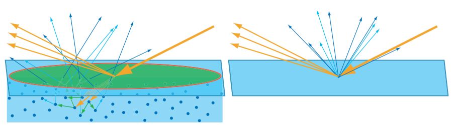

# BRDF(双向反射分布函数)
----
## 1. 物体对光的反应

### 1.1 金属

对于金属，折射进表面的光线的能量会立即被金属中的自由电子吸收，转换成电子的能量，不再可见
### 1.2 非金属

对于非金属（电介质或绝缘体），它们往往不是由单一成分构成，而可以认为其中包含了很多折射率不同的微粒，光线遇到这些粒子后发生反射折射，在物质内部不断传播，散射到不同方向，其中一部分会再次穿过表面被观察到,这种现象称为次表面散射(Subsurface Scattering)
#### 1.2.1 观察尺度
根据物质属性和观察尺度的不同，次表面散射会表现出不同的效果

如果光线在物质中传播距离小于观察尺度（绿色区域，可以认为是一个像素区域），我们看到情况如下面的右上图，入射点、反射点、次表面散射的出射点看起来是同一个点。其中反射部分（图中浅棕色出射光）就是我们常说的高光（Specular Light），常聚集在一个方向周围，向这个方向观察该点会看到明显的高光，从其他方向观察该点时高光则比较微弱；次表面散射部分（图中蓝色出射光）是漫射光（Diffuse Light），光线被散射到各个方向。

如果光线在物质中的传播距离大于观察尺度，就需要使用次表面散射算法来建模

## 2. BRDF

### 2.1 定义
BRDF(bidirectional reflectance distribution function),是用来描述反光小平面的反射光和入射光的比例关系的函数，设一个不透明的、不发光的小平面，BRDF的定义为
$$
f(\vec{\omega_i},\vec{\omega_o})=\frac{dL_o(\vec{\omega_o})}{dE_i(\vec{\omega_i})}
$$

其中$f$就是BRDF函数
$\vec{\omega_i}$是入射光方向，
$\vec{\omega_o}$是观察方向
$L_o(\vec{\omega_o})$是$\vec{\omega_o}$方向反射光的亮度(Luminance)
$E_i(\vec{\omega_i})$是小平面接受的照度在$\vec{\omega_i}$方向上的分量, 由照度和亮度的定义可知，来自入射方向的入射光的辐射率（亮度）为
$$
L_i(\vec{\omega_i})=\frac{d\Phi}{d\omega_i dA^{Proj}}=\frac{d\Phi}{d\omega_i dA\cos\theta_i}=\frac{dE(\vec{\omega_i})}{d\omega_i\cos\theta_i}
$$
得到$dE_i(\vec{\omega_i})=L_i(\vec{\omega_i})\cos\theta_i d\omega_i$，所以
$$
f(\vec{\omega_i},\vec{\omega_o})=\frac{dL_o(\vec{\omega_o})}{L_i(\vec{\omega_i})\cos\theta_i d\omega_i}
$$

### 2.2 特性

$$\begin{split}
f(\vec{\omega_i},\vec{\omega_o})&\ge 0 \\
f(\vec{\omega_i},\vec{\omega_o})&=f(\vec{\omega_o},\vec{\omega_i}) \\
\forall \vec{\omega_i}, \int_{\Omega}f(\vec{\omega_i},\vec{\omega_o})\cos\theta_o d\omega_o&\le 1 
\end{split}$$

### 2.3 **为什么BRDF方程是L和E的比值**
[参考](https://zhuanlan.zhihu.com/p/21376124)
#### 2.3.1 从测量方面来看
测量入射光的设备测量小平面的照度（E）最方便，不用关心方向，而测量出射光则是测量辐射率(L)最方便，用狭长的测光筒
#### 2.3.2 从数学角度来解释
一束光照到平面后，被平面反射到各个方向，其中一个出射方向的光通量只是整个反射光通量极小的一部分，当出射方向立体角趋于0时，
$$\lim_{\omega_o\rightarrow 0}\frac{dL_o}{L_i}=0$$
所以在实际计算中使用辐射率和辐射率比值是没有意义的。而如果分母改成表面上接收到的来自光源方向的微分辐照度，$dE=L_i(l)d\omega\cos\theta_i$，$dE$会小很多，所以比值$dL_o/dE_i$是有意义的
