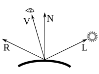

# 光照模型(Illumination Model)

## 1. Phong模型

### 1.1 基本定义

 * $\vec{\mathrm{N}}$表示表面的单位法线矢量  
 * $\vec{\mathrm{L}}$是指向光源的单位矢量  
 * $\vec{\mathrm{R}}$是反射光线的单位矢量  
 * $\vec{\mathrm{V}}$是指向相机的单位矢量  

### 1.2 算法

[https://en.wikipedia.org/wiki/Phong_reflection_model](https://en.wikipedia.org/wiki/Phong_reflection_model)

$$
I_\mathrm{phong}=I_\mathrm{ambient}+\sum({I_\mathrm{diffuse}+I_\mathrm{specular}})
$$

### 1.2.1 **环境光（Ambient Reflection）**
$$
I_\mathrm{ambient}=L_aK_a
$$
其中$L_a$是环境光亮度，$I_a$是环境光反射系数$0\le K_a\le 1$

### 1.2.2 **漫反射（Diffuse Reflection）**

根据Lambert规则，材质的漫反射是均匀发射到周围的，和观察角度无关，只和光源的入射角度有关
$$
I_\mathrm{diffuse}=(\vec{L}\cdot\vec{N})L_dK_d
$$
其中$L_d$是光源的光亮度，$K_d$是漫反射系数$0\le K_d\le 1$

### 1.2.3 **高光反射(Specular Reflection)**

$$
I_\mathrm{specular}=(\vec{\mathrm{R}}\cdot\vec{\mathrm{V}})^nL_sK_s
$$
其中$L_s$是光源亮度，$K_s$是高光反射系数$0\le K_s\le 1$，$n$高光强度

### 1.2.3 **反射射线**
在计算高光反射时，需要计算反射射线$\vec{\mathrm{R}}$
$$
\vec{\mathrm{R}}=2(\vec{\mathrm{L}}\cdot\vec{\mathrm{N}})\vec{\mathrm{N}}-\vec{\mathrm{L}}
$$

