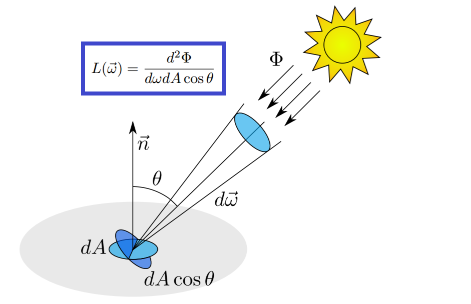

# 光度学
----
## 1. 辐射度学

### 1.1 定义
辐射度学([radiometry](https://en.wikipedia.org/wiki/Radiometry))是一门研究电磁辐射能测量的科学与技术。它是用能量单位描述光辐射能的客观物理量，适用于整个电磁波段

### 1.2 基本单位

|名称|符号|单位|量纲|解释|
|:-|:-|:-|:-|:-|
|辐射能(Radiant energy)|$Q_e$|焦耳($J$)|$ML^2T^{−2}$|发射源所放出的能量|
|辐射通量(Radiant flux)|$\Phi_e=dQ_e/dt$|瓦特($W$)|$ML^2T^{−3}$|每单位时间的辐射能量，亦作“辐射功率”|
|辐射强度(Radiant intensity)|$I_e=d\Phi_e/d\omega$|瓦特每球面度 ($W/sr$)|$ML^2T^{−3}$|给定传输方向上，由一个点光源发出的单位立体角内的辐射通量|
|辐射亮度(Radiance)|$\begin{split}L_e&=\frac{dI_e}{dA\cos\theta}\\&=\frac{d^2\Phi_e}{dAd\omega\cos\theta}\end{split}$|瓦特每球面度每平方米 ($W/(sr·m^2$))|$MT^{−3}$|辐射表面在垂直其辐射传输方向上单位表面积单位立体角内发出的辐射通量|
|辐射出射度(Radiant exitance)|$\displaystyle M_e=\frac{d\Phi_e}{dA}$|瓦特每平方米 ($W/m^2$)|$MT^{−3}$|离开光源表面单位面积内的辐射通量|
|辐照度(Irradiance)|$\displaystyle E_e=\frac{d\Phi_e}{dA}$|瓦特每平方米 ($W/m^2$)|$MT^{−3}$|物体表面单位面积内接收到的辐射通量|

## 2. 光度学

### 2.1 定义
光度学([Photometry ](https://en.wikipedia.org/wiki/Photometry_%28optics%29))只限于可见光范围内（380nm-780nm），并以人眼的视觉特性为基础。

### 2.2 光度函数
各个波长的光给人眼带来的“明亮”的感觉并不一致，而且这种视觉反应因个体的差异而有所不同，因此光度学把不同波长的辐射功率用光度函数([Luminosity function](https://en.wikipedia.org/wiki/Luminosity_function))加权，这个函数经由国际照明委员会（CIE）确认后，现已成为所有色彩科学使用的标准函数。

#### 2.2.1 定义
光谱光效能
$$
K(\lambda)=\frac{\Phi_v(\lambda)}{\Phi_e(\lambda)}
$$
表示在某一波长上每一瓦辐射通量可以产生多少流明的光通量。
$\Phi_e(\lambda)$即为上文所说的辐射通量，是真实的亮度，单位是瓦特;
$\Phi_v(\lambda)$叫光通量，即人眼感觉到的假的亮度，单位是流明。

#### 2.2.2 数据
光谱光效度（视觉函数）
$$
V(\lambda) =\frac{K( \lambda) }{K_{\mathrm{max}}}
$$
就是归一化的光谱光效能

蓝色线是人眼的暗视觉视觉函数数据，红色线是人眼的明视觉函数数据

### 2.3 基本单位

#### 2.3.1 基本单位

|名称|符号|单位|量纲|解释|
|:-|:-|:-|:-|:-|
|光量(Luminous energy)|$Q_v$|流明·秒 $lm·s$|$JT$||
|光通量(Luminous flux)|$\Phi_v=dQ_v/dt$|流明 $lm=cd·sr$|$J$|单位时间内由光源所发出或由被照物所吸收的总光能|
|发光强度(Luminous intensity)|$I_v=d\Phi_v/d\omega$|坎德拉 $cd=lm/sr$|$J$|光源在给定方向上，每单位立体角内所发出的的光通量|
|亮度(Luminance)|$\begin{split}L_v&=\frac{dI_v}{dA\cos\theta}\\&=\frac{d^2\Phi_v}{dAd\omega\cos\theta}\end{split}$|坎德拉每平方米 $cd/m^2$|$JL^{-2}$|单位面积光源在给定方向上，在每单位立体角内所发出的总光通量。其单位有时也称尼特（nit）|
|光出射度(Luminous exitance)|$\displaystyle M_v=\frac{d\Phi_v}{dA}$|勒克斯 $lx= lm/m^2$|$JL^{-2}$|物体表面每单位面积所发出可见光的光通量，用于出射表面的光|
|照度(Illuminance)|$\displaystyle E_v=\frac{d\Phi_v}{dA}$|勒克斯 $lx=lm/m^2$|$JL^{-2}$|物体表面每单位面积所接收的可见光的光通量，用于出入射表面的光|

#### 2.3.2 坎德拉
坎德拉([Candela](https://en.wikipedia.org/wiki/Candela))是描述发光强度(Luminous intensity)的单位，是七大基本单位之一，给定一个频率为540.0154×1012 Hz的单色辐射光源（黄绿色可见光）与一个方向，且该辐射源在该方向的辐射强度为1/683瓦特每球面度，则该辐射源在该方向的发光强度为1坎德拉

#### 2.3.3 流明
流明([lumen](https://en.wikipedia.org/wiki/Lumen_%28unit%29))光通量（luminous flux）,如果一个光源发射1坎德拉的发光强度到1个立体角的范围里,则到那个立体角的总发射光通量就是1流明，或者说，一个各向同性的一坎德拉光源发射的总光通量为$4\pi$流明

### 2.4 单位解释

#### 2.4.1 光通量$\phi$

单位时间内，光源发射的能量，对应辐射度学中的单位为焦耳

#### 2.4.2 发光强度$I$

单位时间内，光源在单位立体角内发射的能量

#### 2.4.3 照度$E$/出射度$M$

和发光强度类似，光源通过单位面积发射的总光通量为出射度$M$，受光体表面单位面积接收到的总光通量为照度$E$

测量照度的设备

#### 2.4.4 照度的衰减

对于理想的方向光，照度不随距离而变化，但位于点光源来说，照度随着距离的增大而衰减，反比于距离的平方
$$
E=\frac{Id\omega}{dA}=\frac{I}{dA}\frac{dA}{r^2}=\frac{I}{r^2}
$$

#### 2.4.5 亮度$L$

对于一个受光体小平面$dA$，其法线为$\vec{\boldsymbol n}$，指向光源的方向为$\vec{\omega}$，夹角为$\theta=\cos^{-1}(\vec{\boldsymbol n}\cdot\vec{\omega})$，那么定义该小平面在$\vec{\omega}$方向上的亮度为
$$
L(\vec{\omega})=\frac{d^2{\Phi}}{d\omega dA\cos\theta}
$$

### 2.5 亮度(luminance)的特性

#### 2.5.1 
在光源传播方向上，lumiance保持不变，与距离无关

设一个发光小平面，面积为$dA_s$，一个受光小平面，面积为$dA_r$，距离为$r$，两个平面相对于传播方向的夹角分别是$\theta_s$和$\theta_r$，发光平面发出的光中的一部分光通量被接受平面收到
那么对于发光平面来说，分析它在光的传播方向上的luminance，首先立体角
$$
\omega_s=\frac{dA_r\cos\theta_r}{r^2}
$$
同理
$$
\omega_r=\frac{dA_s\cos\theta_s}{r^2}
$$

发光面在光传播方向上的光亮度为$L_s$，根据光亮度的定义，发光面在此传播方向上发射的光通量
$$
d^2\Phi=L_s dA_s d\omega_s \cos\theta_s
$$
受光面在传播方向上的光亮度$L_r$，根据能量守恒，此方向传播的光通量全部被受光面接受，所以
$$
d^2\Phi=L_r dA_r d\omega_r \cos\theta_r
$$
代入前面的立体角公式可得
$$
\begin{aligned}
d^2\Phi&=\displaystyle{L_sdA_s\cos\theta_s\frac{dA_r\cos\theta_r}{r^2}}\\
&=\displaystyle{L_rdA_r\cos\theta_r\frac{dA_s\cos\theta_s}{r^2}}
\end{aligned}
$$
整理可得
$$
L_s=L_r
$$
#### 2.5.2 
图像传感器、人眼或者照相机感受或测量的量直接正比于Luminance, 因此图形学中主要计算的量就是这个量

### 2.6 这几个量的关系
$$\begin{split}
E&=\int_{2\pi}{L_i(\vec\omega)\cos\theta d\omega} \\
M&=\int_{2\pi}{L_o(\vec\omega)\cos\theta d\omega} \\
I(\vec\omega)&=\int_{A}{L(\vec\omega)\cos\theta dA} \\
\Phi&=\int_{A}\int_{2\pi}{L(\vec\omega)\cos\theta d\omega dA}
\end{split}$$

