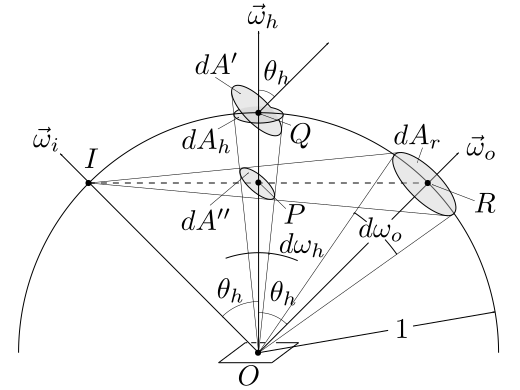

# 微平面理论(一)
----
## 1. 概述
微表面理论（Microfacet Theory）认为我们看到的表面上的一点是由很多朝向各异且光学平的微小表面组成。当光线从$\vec{l}$方向照射到这点，而我们在$\vec{v}$方向观察时，由于光学平面只会将光线$\vec{l}$反射到关于法线对称的$\vec{v}$方向，而$\vec{l}$和$\vec{v}$已经确定，所以只有法线朝向正好是$\vec{l}$和$\vec{v}$的半角向量$\vec{h}$的微表面才会将光线发射到$\vec{v}$方向，从而被我们看见。

## 2. 法线分布函数
### 2.1 定义
法线分布函数（Normal Distribution Function，简写为NDF）用来描述微表面法线的概率分布，可以这样理解：向NDF输入一个朝向h，NDF会返回法线是$\vec{h}$的微表面数占微表面总数的比例，需要注意的是$D(h)$是描述微表面**数量**的概率分布函数

### 2.2 微表面的面积
设一个小平面，面积为$dA$，此小平面由更小的微表面组成，其中法线为$\vec{h}$的微表面的概率为$D(h)$，这些微表面的面积总和为$D(h)dA$，考虑到法线范围，定义微表面的法线为$\vec{h}$，范围在立体角$d\omega_h$之内的所有微表面的表面积为
$$
dA(\vec{h})=D(\vec{h})d\omega_h dA
$$

## 3. 几何衰减因子

### 3.1 定义
由于微表面之间的互相遮挡(Shadowing)，并不是所有微表面能够接收到光线，还有一部分微表面反射的光线会被阻挡(Masking)，还有一部分光线会在微表面之间互相反射.
Shadowing和Masking效应用几何衰减因子(Geometrical Attenuation Factor)来表示，用$G(l,v)$表示

## 4. 菲涅尔方程
### 4.1 定义
光学平面会将一部分光线反射，一部分光线折射，其中反射光线的比例用菲尼尔方程(Fresnel Equations)计算，用$F(\vec{\omega}_i,\vec{\omega}_h)$表示，因为菲尼尔函数一般只和光线和法线之间的夹角相关，有时候也会用$F(\vec{\omega}_i\cdot\vec{\omega}_h)$表示

## 5.Cook-Torrance模型

### 5.1 定义
Cook-Torrance模型用来描述反射平面的的BRDF模型中的高光(Specular)部分，公式为
$$
f(\vec{\omega}_i,\vec{\omega}_o)=\frac{F(\vec{\omega}_i,\vec{\omega}_h)G(\vec{\omega}_i,\vec{\omega}_o)D(\vec{\omega}_h)}{4(\vec{n}\cdot \vec{\omega}_i)(\vec{n}\cdot\vec{\omega}_o)}
$$

### 5.2 推导过程
设一个小平面，面积为$dA$，法线方向$\vec{n}$，入射光方向$\vec{\omega}_i$，微分变量为$d\omega_i$，观察方向$\vec{\omega}_o$，微分变量为$d\omega_o$

根据上面的推导，这个小平面上所有法线为$\vec{\omega_h}$的微平面的面积为
$$
dA(\vec{\omega_h})=D(\vec{\omega_h})d\omega_h dA
$$
由于其他微平面接受的入射光通量不会反射到$\vec{\omega}_o$方向上，所以不用考虑，所以在$\vec{\omega}_h$方向上有效入射光通量为
$$\begin{split}
d\Phi_h&=L_i(\vec{\omega}_i)\cos(\theta_h)dA(\vec{\omega_h})d\omega_i \\
&=L_i(\vec{\omega}_i)\cos(\theta_h)D(\vec{\omega_h})d\omega_h dA
 d\omega_i 
\end{split}$$
出射光通量为
$$
d\Phi_o=dL_o(\vec{\omega}_o)\cos(\theta_o)dAd\omega_o
$$
根据菲尼尔公式，出射光通量和入射光通量的比例可以用如下公式表示
$$
d\Phi_o = F(\vec{\omega}_i, \vec{\omega}_h)d\Phi_h
$$
联立以上公式可得
$$\begin{split}
dL_o(\vec{\omega}_o)&=\dfrac{d\Phi_o}{\cos(\theta_o)dAd\omega_o}\\
&=\dfrac{F(\vec{\omega}_i, \vec{\omega}_h)d\Phi_h}{\cos(\theta_o)dAd\omega_o} \\
&=\dfrac{F(\vec{\omega}_i, \vec{\omega}_h)L_i(\vec{\omega}_i)\cos(\theta_h)D(\vec{\omega_h})d\omega_hd\omega_i
}{\cos(\theta_o)d\omega_o}
\end{split}$$
根据BRDF的定义
$$\begin{split}
f(\vec{\omega}_i,\vec{\omega}_o)&=\dfrac{dL_o(\vec{\omega}_o)}{L_i(\vec{\omega}_i)\cos(\theta_i)d\omega_i} \\
&=\dfrac{F(\vec{\omega}_i, \vec{\omega}_h)D(\vec{\omega}_h)\cos(\theta_h)}{\cos(\theta_o)\cos(\theta_i)}\cdot\dfrac{d\omega_h}{d\omega_o}
\end{split}$$

下面考察$d\omega_o$和$d\omega_h$的关系，设小平面上的一个微平面，接受的入射光线方向为$\vec{\omega}_i$, 法线为$\vec{\omega}_h$，出射光线方向为$\vec{\omega}_o$，和单位圆的交点分别是$I,Q,R$

立体角$d\omega_h$和立体角$d\omega_o$之间的约束关系在于，保持$\vec{\omega}_i$不变，让法线$\vec{\omega}_o$在立体角$d\omega_o$范围之内移动，则$\vec{\omega}_h$需要保证是$\vec{\omega}_i$和$d\omega_o$的半角法线，它的活动范围$d\omega_h$比较小，具体可以计算一下
$$
\dfrac{d\omega_h}{d\omega_o}=\dfrac{dA_h}{dA_r}
$$
连接$IR$相交法线$\vec{\omega}_h$于交点$P$，由于$IR=2IP$，所以
$$
\dfrac{dA_r}{dA''}=4
$$
由于$OP=\cos(\theta_h)$，所以
$$
\dfrac{dA'}{dA''}=\dfrac{1}{\cos^2(\theta_h)}
$$
由于$dA_h=dA'\cos(\theta_h)$，联立以上公式，可以得到
$$
\dfrac{d\omega_h}{d\omega_o}=\dfrac{1}{4\cos(\theta_h)}
$$
带入上面的BRDF公式，可以得到
$$
f(\vec{\omega}_i,\vec{\omega}_o)=\dfrac{F(\vec{\omega}_i, \vec{\omega}_h)D(\vec{\omega}_h)}{4\cos(\theta_o)\cos(\theta_i)}
$$
将几何衰减因子G考虑在内，可以得到
$$
f(\vec{\omega}_i,\vec{\omega}_o)=\dfrac{F(\vec{\omega}_i, \vec{\omega}_h)D(\vec{\omega}_h)G(\vec{\omega}_i, \vec{\omega}_o)}{4\cos(\theta_o)\cos(\theta_i)}
$$