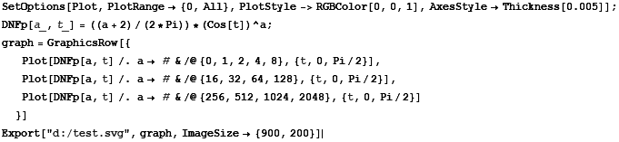
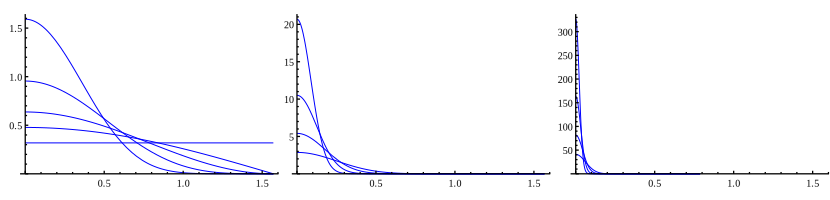
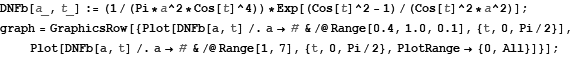
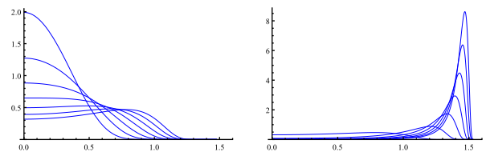
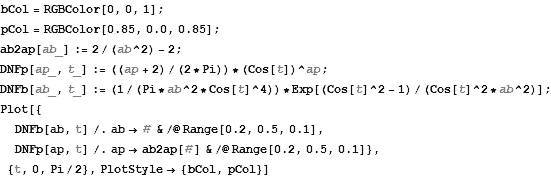
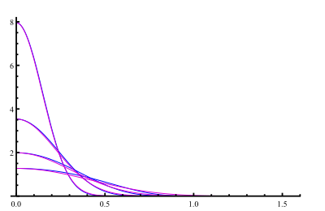
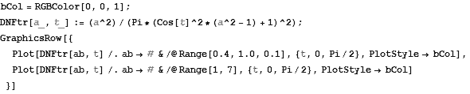
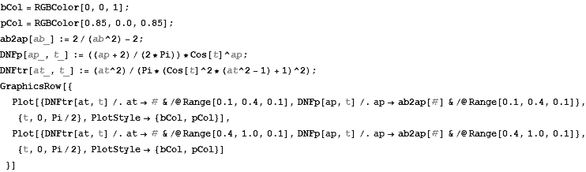
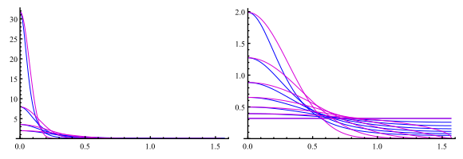

# 微平面理论(二)
-----
## 6. 法线分布函数详解
### 6.1 归一化约束
所有的法线分布函数都应该符合以下约束
$$
(\vec{v}\cdot\vec{n})=\int_{\Omega}D(m)(\vec{v}\cdot\vec{m})d\omega_m
$$
可以理解为，这些为平面在某个指定方向上的投影面积，等于整体宏平面的投影面积

当$v=n$时，有
$$
1=\int_{\Omega}D(\vec{m})(\vec{n}\cdot\vec{m})d\omega_m
$$

### 6.2 Phong
Phong模型认为，反射强度正比于$(\vec{n}\cdot\vec{m})^\alpha$，其中$\alpha$表示材质的“光滑程度”，当$\alpha=0$，材质是绝对的漫反射材质，当$\alpha\rightarrow\infty$，材质成为绝对光滑的镜面，设
$$
D_{phong}(\vec{m})=R_p(\vec{n}\cdot\vec{m})^\alpha
$$
由上面法线分布函数的归一性可知
$$
1=\int_{\Omega}R_p(\vec{n}\cdot\vec{m})^{\alpha+1}d\omega_m
$$
由于$d\omega_m=\sin(\theta)d\phi d\theta$

$$
1=\int_0^{2\pi}\int_0^{\pi/2}R_p\cos^{\alpha+1}(\theta)\sin(\theta)d\theta d\phi=\dfrac{2\pi}{2+\alpha}R_p
$$
可以得到最终D函数为
$$
D_{phong}(\vec{m})=\dfrac{2+\alpha}{2\pi}(\vec{n}\cdot\vec{m})^\alpha
$$
一般引擎用粗糙度（取值范围[0,1])表示材质的光滑程度，Phong模型中的$\alpha$常用如下公式计算
$$
\alpha_{phong}=\dfrac{2}{roughness^4}-2
$$
用Mathmatica绘制函数图

### 6.3 Beckmann
Beckmann的法线分布函数为
$$
\displaystyle{D_{beckmann}(\vec{m})=R_{beckmann}\dfrac{1}{\alpha^2(\vec{n}\cdot\vec{m})^4}e^{-\left(\dfrac{1-(\vec{n}\cdot\vec{m})^2}{(\vec{n}\cdot\vec{m})^2\alpha^2}\right)}}
$$
经过积分计算$R_{beckmann}=1/\pi$，所以
$$
\displaystyle{D_{beckmann}(\vec{m})=\dfrac{1}{\pi\alpha^2(\vec{n}\cdot\vec{m})^4}e^{-\left(\dfrac{1-(\vec{n}\cdot\vec{m})^2}{(\vec{n}\cdot\vec{m})^2\alpha^2}\right)}}
$$
Beckmann法线分布函数中，$\alpha$同样代表了材质的粗糙度，趋向于0时表示绝对光滑，取值却大约粗糙，但当取值超过1时，材质会变得“超级粗糙”（诡异），$\alpha$用如下公式获取
$$
\alpha_{beckmann}=roughness^2
$$

当$\alpha$取值在0.5以下时，Beckmann模型和Phong模型的结果非常相似，这两个参数可以有如下对应关系
$$
\alpha_{phong}=\dfrac{2}{\alpha_{beckmann}^2}-2
$$

### 6.4 Trowbridge-Reitz(GGX)
这个模型又被称为GGX模型，是UnrealEngine采用的法线分布函数
$$
D_{GGX}(\vec{m})=R_{GGX}\dfrac{1}{((\vec{n}\cdot\vec{m})^2(\alpha^2-1)+1)^2}
$$
经过积分$R_{GGX}=\alpha^2/\pi$，所以
$$
D_{GGX}(\vec{m})=\dfrac{\alpha^2}{\pi((\vec{n}\cdot\vec{m})^2(\alpha^2-1)+1)^2}
$$
在Mathmatica中的模拟

可以看出，当$\alpha$趋向于0，表示材质越光滑，当$\alpha=1$时，GGX称为一条直线，也就是纯粹的漫反射材质，当$\alpha>1$，GGX模型的表现类似于Beckmann，表现出“超级粗糙”特性。
和Phong模型比较，可以看出在粗糙度小于0.4时，ggx和phong模型比较类似，当粗糙度大于0.4时，ggx的表现更“平顺”一些，高光中心更集中，但长尾区域更长。

在Unreal实现中，定义了$\alpha=roughness^2$， roughness是用户输入的材质粗糙度，范围在[0,1]之间
