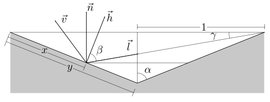

# 微表面理论(三)
-----
## 7.  几何衰减因子
### 7.1 定义
一束光线照射到微平面上，在到达之前或者反射之后，有可能被其他微平面阻挡，这种阻挡造成族中出射光线的衰减，可以用几何衰减因子$G$描述这种衰减程度

### 7.2 Torrance-Sparrow
以入射光线被阻挡为例，计算衰减因子$G$

根据上图可知
$$
\sin\alpha=\dfrac{1}{y}
$$
根据正弦定理
$$
\dfrac{x}{\sin\gamma}=\dfrac{2}{\sin(\beta+\pi/2)}
$$
联立以上两式，可以得到入射光线的有效比例为
$$
G_1=\dfrac{x}{y}=\dfrac{2\sin\gamma\sin\alpha}{\sin(\beta+\pi/2)}
$$
其中
$$
\begin{aligned}
\sin\alpha&=\vec{n}\cdot\vec{h} \\
\sin(\beta+\pi/2)&=\cos\beta=\vec{v}\cdot\vec{h} \\
\sin\gamma&=\vec{n}\cdot\vec{l}
\end{aligned}
$$
所以可以求得
$$
G_1=\dfrac{2(\vec{n}\cdot\vec{h})(\vec{n}\cdot\vec{l})}{\vec{v}\cdot\vec{h}}
$$
同理，反转$\vec{v}$和$\vec{l}$，可以求得反射光线被微表面阻挡的情况
$$
G_2=\dfrac{2(\vec{n}\cdot\vec{h})(\vec{n}\cdot\vec{v})}{\vec{v}\cdot\vec{h}}
$$
所以光线受几何衰减因子的影响共有三种可能性，完全不受影响，照射光被阻挡，反射光被阻挡，最终的表达式为
$$
\begin{aligned}
G(\vec{l},\vec{v},\vec{h})&=\min\{1,G_1,G_2\}\\
&=\min\left\{1,\dfrac{2(\vec{n}\cdot\vec{h})(\vec{n}\cdot\vec{l})}{\vec{v}\cdot\vec{h}}
,\dfrac{2(\vec{n}\cdot\vec{h})(\vec{n}\cdot\vec{v})}{\vec{v}\cdot\vec{h}}
\right\}
\end{aligned}
$$

### 7.3 Schlick-Beckmann
在Unreal Engine中，使用了这种模型，在这种模型中
$$
\begin{aligned}
G(\vec{l},\vec{v},\vec{h})&=G_1(\vec{l})G_1(\vec{v}) \\
G_1(\vec{v})&=\dfrac{\vec{n}\cdot\vec{v}}{(\vec{n}\cdot\vec{v})(1-k)+k}
\end{aligned}
$$
在原始的Schlick算法中，定义
$$
k=\alpha\sqrt{\frac{2}{\pi}}
$$
在Unreal实现中，调整为
$$
k=\frac{\alpha}{2}
$$
根据所计算的光源的不同，$\alpha$的定义也不同，当使用间接光源(IBL)时
$$
\begin{aligned}
\alpha&=roughness^2\\
k&=\dfrac{roughness^2}{2}
\end{aligned}
$$
使用直接光源时，
$$
\begin{aligned}
\alpha&=\left(\frac{roughness+1}{2}\right)^2\\
k&=\dfrac{(roughness+1)^2}{8}
\end{aligned}
$$

## 8. 菲尼尔反射方程
### 8.1 定义
当入射光线碰到一个反射平面时，菲尼尔反射方程会根据观察角度计算出反射光线所占的比例。当光线垂直入射时，材质反射的光线的比例称为基础反射率(Base Reflectivity)，一般用$F_0$表示，随着入射角的增大，反射的比例会增加，这种现象被称为菲涅尔现象。

### 8.2 Schlick
菲涅尔方程是一个相当复杂的方程式，一般用Fresnel-Schlick近似:
$$
F_{schlick}(\vec{l},\vec{h},F_0)=F_0+(1-F_0)(1-(\vec{l}\cdot\vec{h}))^5
$$
在Mathmatica中模拟

在Unreal引擎中，使用了一个模拟运算以加快速度
$$
F_{schlick}(\vec{l},\vec{h},F_0)=F_0+(1-F_0)2^{(-5.55473(\vec{l}\cdot\vec{h})-6.98316)(\vec{l}\cdot\vec{h})}
$$
### 8.3 导体和绝缘体
对于大多数绝缘体（非金属），$F_0$的范围在0.02和0.05之间，实际运算中一般取经验平均值$F_0=0.04$，并且绝缘体的$F_0$对不同波长的光的数值是相同的，可以视作一个灰度值。
对于导体（金属），$F_0$的范围在0.5到1.0之间，并且对不同的波长的光的数值不同，所以在实际运算中，$F_0$的取值一般使用如下公式获得
$$
F_0=\text{mix}(0.04,Color,Metalness)
$$
其中$Metalness$表示金属度，0表示存粹的绝缘体(非金属)，1表示导体(金属)
