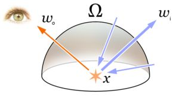

# 渲染方程（一）
----
## 1. 定义

### 1.1 反射方程
计算反射表面反射到$\vec{\omega_o}$方向上的来自于上半球所有方向入射光的辐射率

$$
L_o(\vec{\omega_o})=\int_{\Omega}f(\vec{\omega_i},\vec{\omega_o})L_i(\vec{\omega_i})\cos\theta_id\omega_i
$$
上式称为反射方程（Reflectance Equation），用来计算表面反射辐射率

### 1.2 渲染方程
将反射方程增加上自发光因素，可以得到渲染方程([Rendering equation](https://en.wikipedia.org/wiki/Rendering_equation))
$$
L_{o}(\vec{\omega_o}) = L_{e}(\vec{\omega_o})+\int_{\Omega}f(\vec{\omega_i},\vec{\omega_o})L_i(\vec{\omega_i})\cos\theta_id\omega_i
$$
完整形式的渲染方程，需要考虑到反射平面所处的位置、时间，光的波长这些因素，具体形式为
$$
L_o(\mathbf{x},\vec{\omega_o},\lambda,t)=L_e(\mathbf{x},\vec{\omega_o},\lambda,t)+\int_{\Omega}f(\mathbf{x},\vec{\omega_i},\vec{\omega_o},\lambda,t)L_i(\mathbf{x},\vec{\omega_i},\lambda,t)(\vec{\omega_i}\cdot\vec{\mathbf {n}}) d\omega_i
$$

## 2. 反射方程分解
根据前面的微表面理论分析，入射光能量在材质表面分解为两部分，高光反射部分，比例为$k_s=F$，折射到材质内部的部分，比例为$1-F$，这部分能量一部分在材质内部转换为其他能量消失掉（对于金属材质为全部），一部分重新从表面发射出去，称为漫反射，所以漫反射的比例为$k_s=(1-F)(1-M)$，其中$M$表示金属度，范围从0到1，所以可以将反射方程中的BRDF分解为两部分
$$
f(\vec{\omega_i},\vec{\omega_o})=k_df_d(\vec{\omega_i},\vec{\omega_o})+k_sf_s(\vec{\omega_i},\vec{\omega_o})
$$

## 3. Lambert漫反射模型
[参考](https://zhuanlan.zhihu.com/p/21489591)
Lambert模型认为，材质的漫反射是均匀发射到所有方向的，所以$f_d$是一个常数，先设想一个最简单的情况，材质只有漫反射，也就是$k_d=1,k_s=0$,入射光均匀遍布所有的方向，而且每个方向的亮度都是相同的常数。因为这样$f_d$和$L_i$都是常数，可以提到积分外面。反射方程变成
$$
L_o=f_dL_i\int_{\Omega}\cos\theta_id\omega_i
$$
计算这个半球积分
$$
\displaystyle{\int_{\Omega}\cos\theta d\omega=\int_{-\pi}^{\pi}\int_{0}^{\pi/2}}\sin(\theta)\cos(\theta)d\theta d\phi=\pi
$$

得到
$$
L_o = f_dL_i\pi
$$
考虑一下，如果所有方向都有射向球面的光，而且每个方向的光强度都等于$L_i$，那么小平面受到的入射光照度，应该等于光强度乘以半球面积。
$$
E_i=2\pi L_i
$$
根据能量守恒，光出射度$M_o=E_i$
$$
M_o=2\pi L_o=2\pi ^2 f_dL_i=2\pi L_i
$$
可知
$$
f_d=\frac{1}{\pi}
$$
考虑材质的颜色，在这里颜色可定义为对三原色的吸收比例，比如白色(1,1,1)表示不吸收任何光，红色(1,0,0)表示将绿色和蓝色完全吸收掉，所以最终漫反射的BRDF为
$$
f_d=\dfrac{c}{\pi}
$$

## 4.最终形式
Cook-Torrance模型其实就是一种材质的高光模型，公式
$$
f_s=\frac{DGF}{4(\vec{n}\cdot \vec{\omega}_i)(\vec{n}\cdot\vec{\omega}_o)}
$$
中的$F$就是高光反射的分量比例$k_s$，所以结合在一起，得到最终的渲染方程为
$$
L_o(\vec{\omega_o})=L_{e}(\vec{\omega_o})+\int_{\Omega}\left(k_d\dfrac{c}{\pi}+\dfrac{DGF}{4(\vec{\omega}_o\vec{n})(\vec{\omega}_i\vec{n})}\right)L_i(\vec{\omega_i})(\vec{\omega}_i\vec{n})d\omega_i
$$
其中
$$
k_d=(1-F)(1-M)
$$

