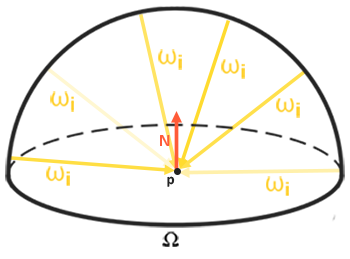

# 环境光渲染(一）
----
## 1. 定义
使用一张HDR环境图片作为环境光源，每个像素表示一个光源和入射方向，回顾一下渲染方程
$$
L_o(\vec{\omega_o})=\int_{\Omega}\left(k_d\dfrac{c}{\pi}+f_s(\vec{\omega_i}, \vec{\omega_o})\right)L_i(\vec{\omega_i})(\vec{\omega}_i\vec{n})d\omega_i
$$
显然在实时渲染系统中，针对环境贴图做完整的积分运算代价非常昂贵，所以需要做预处理

## 2.漫反射部分
### 2.1 原理
只考虑渲染方程中的漫反射部分
$$
L_{od}(\vec{\omega_o})=k_d\dfrac{c}{\pi}\int_{\Omega}L_i(\vec{\omega_i})(\vec{\omega}_i\vec{n})d\omega_i
$$
将其中之和光照贴图相关的部分做一个预计算，针对所有球面方向，每个方向做一个半球积分
$$
\dfrac{1}{\pi}\int_{\Omega}L_i(\vec{\omega_i})(\vec{\omega}_i\vec{n})d\omega_i
$$
将结果存成一张新的环境贴图Irradiance,那么最终实时渲染时，漫反射部分可以这个贴图来计算
$$
L_{od}(\vec{\omega_o})=\text{TexCube}(\text{IrrMap}, \vec{n})*k_d*c
$$
### 2.2 漫反射环境贴图的生成



#### 2.2.1 球坐标积分
将立体角转换为球坐标
$$\begin{split}
&\dfrac{1}{\pi}\int_{\Omega}L_i(\vec{\omega_i})(\vec{\omega}_i\vec{n})d\omega_i\\
=&\dfrac{1}{\pi}\int_{\phi=0}^{2\pi}\int_{\theta=0}^{\pi/2}L_i(\phi,\theta)\cos(\theta)\sin(\theta)d\theta d\phi\\
\approx&\dfrac{1}{\pi}\dfrac{2\pi}{n_1}\dfrac{\pi}{2n_2}\sum_{j=0}^{n_1}\sum_{i=0}^{n_2}L_i(\phi_j,\theta_i)\cos(\theta_i)\sin(\theta_i) \\
=&\dfrac{\pi}{n_1n_2}\sum_{j=0}^{n_1}\sum_{i=0}^{n_2}L_i(\phi_j,\theta_i)\cos(\theta_i)\sin(\theta_i)
\end{split}$$
其中：$\phi_j=\dfrac{j}{n_1}2\pi \\ \theta_i=\dfrac{i}{n_2}\dfrac{\pi}{2}$
代码:
````cpp :no-line-numbers
vec3 irradiance = vec3(0.0);  

// tangent space calculation from origin point(x'=up, y'=N, z'=left)(left-hand)
vec3 up    = vec3(0.0, 1.0, 0.0);   //x'
vec3 left = cross(up, N);			//z'
up         = cross(N, left);		//x'

float sampleDelta = 0.025;
float nrSamples = 0.0; 
for(float phi = 0.0; phi < 2.0 * PI; phi += sampleDelta)
{
    for(float theta = 0.0; theta < 0.5 * PI; theta += sampleDelta)
    {
        float cosTheta = cos(theta);
        float sinTheta = sin(theta);
    
        // spherical to cartesian (in tangent space)
        vec3 tangentSample = vec3(cos(phi) * sinTheta, cosTheta, sin(phi) * sinTheta);
        // tangent space to world
        vec3 sampleVec = tangentSample.x * up + tangentSample.y * N + tangentSample.z * left; 

        irradiance += texture(environmentMap, sampleVec).rgb * cosTheta * sinTheta;
        nrSamples++;
    }
}
irradiance = PI * irradiance * float(nrSamples);
````
#### 2.2.2 蒙特卡洛估算
使用蒙特卡洛采样估算积分
$$
\displaystyle\int_{a}^{b}f(x)dx\approx\dfrac{1}{N}\sum_{i=1}^{N}\dfrac{f(X_i)}{\text{pdf}(X_i)}
$$
其中$\text{pdf}(x)$函数是采样时使用的概率分布函数。
方法1：
对于要计算的这个二维积分,如果使用的随机采样是$\phi$在$[0,2\pi]$之间均匀分布，$\theta$在$[0,\pi/2]$之间均匀分布，那么
$$
\text{pdf}(\phi)=1/(2\pi) , \text{pdf}(\theta)=2/\pi
$$
$$\begin{split}
&\dfrac{1}{\pi}\int_{\phi=0}^{2\pi}\int_{\theta=0}^{\pi/2}L_i(\phi,\theta)\cos(\theta)\sin(\theta)d\theta d\phi \\
=&\dfrac{1}{\pi}\dfrac{2\pi}{n_1}\sum_{j=0}^{n_1}\left(\dfrac{\pi}{2n_2}\sum_{i=0}^{n_2}L_i(\phi_j,\theta_i)\cos(\theta_i)\sin(\theta_i)
 \right) \\
 =&\dfrac{\pi}{n_1n_2}\sum_{j=0}^{n_1}\sum_{i=0}^{n_2}L_i(\phi_j,\theta_i)\cos(\theta_i)\sin(\theta_i)\\
=&\dfrac{\pi}{N}\sum_{i=0}^{N}L_i(\phi_i,\theta_i)\cos(\theta_i)\sin(\theta_i)
\end{split}$$
其中
$$
\phi_i=2\pi\xi, \theta_i=\dfrac{\pi}{2}\xi
$$
$\xi$表示均匀分布在[0,1]之间的随机变量

方法2：
上面的采样方法在极点位置会比较密集，在赤道位置比较稀疏，由于漫反射是均匀分布的，如果采样点也是均匀分布在半球面上的，收敛速度会比较快，这种情况下
$$
\text{pdf}(\phi)=1/(2\pi) , \text{pdf}(\theta)=\sin(\theta)
$$
$$\begin{split}
&\dfrac{1}{\pi}\int_{\phi=0}^{2\pi}\int_{\theta=0}^{\pi/2}L_i(\phi,\theta)\cos(\theta)\sin(\theta)d\theta d\phi \\
=&\dfrac{1}{\pi}\dfrac{2\pi}{n_1}\sum_{j=0}^{n_1}\left(\dfrac{1}{n_2}\sum_{i=0}^{n_2}L_i(\phi_j,\theta_i)\cos(\theta_i)
 \right) \\
 =&\dfrac{2}{n_1n_2}\sum_{j=0}^{n_1}\sum_{i=0}^{n_2}L_i(\phi_j,\theta_i)\cos(\theta_i)\\
=&\dfrac{2}{N}\sum_{i=0}^{N}L_i(\phi_i,\theta_i)\cos(\theta_i)
\end{split}$$
其中
$$
\phi_i=2\pi\xi, \theta_i=\arccos(1-\xi)
$$
````cpp :no-line-numbers
vec3 irradiance = vec3(0.0);  

vec3 up = vec3(0.0, 1.0, 0.0); //x'
vec3 left = cross(up, N);	//z'
up = cross(N, left);	//x'

for(uint i=0; i<sampleCounts; i++)
{
    //http://holger.dammertz.org/stuff/notes_HammersleyOnHemisphere.html
    vec2 uv = Hammersley(i, totalCounts);

    // tangent space sample point
    float phi = uv.y * 2.0 * PI;
    float cosTheta = 1.0 - uv.x;
    float sinTheta = sqrt(1-cosTheta*cosTheta);
    vec3 tangentSample = vec3(cos(phi) * sinTheta, cosTheta, sin(phi) * sinTheta);

    // tangent space to world
    vec3 sampleVec = tangentSample.x * up + tangentSample.y * N + tangentSample.z * left; 

    irradiance += texture2D(s_texSkybox, sampleVec).rgb * cosTheta;
}

irradiance = 2*irradiance / float(sampleCounts);
````

