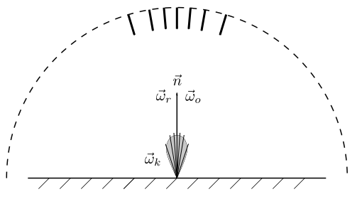
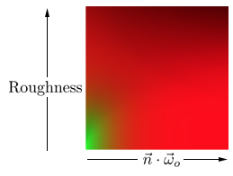

# 环境光渲染(二）
-----
## 3. 高光部分
### 3.1 原理
光照方程中的高光部分
$$
L_{os}(\vec{\omega_o})=\int_{\Omega}f_s(\vec{\omega_i}, \vec{\omega_o})L_i(\vec{\omega_i})(\vec{\omega}_i\cdot\vec{n})d\omega_i
$$
同样使用蒙特卡洛进行近似积分
$$
\int_{\Omega}f_s(\vec{\omega_i}, \vec{\omega_o})L_i(\vec{\omega_i})(\vec{\omega}_i\vec{n})d\omega_i \approx \dfrac{1}{N}\sum_{k=1}^{N}\dfrac{f_s(\vec{\omega_k}, \vec{\omega_o})L_i(\vec{\omega_k})(\vec{\omega_k}\cdot\vec{n})}{\text{pdf}(\vec{\omega_k})}
$$
EPIC在此基础上提出了一种近似[计算方法](http://blog.selfshadow.com/publications/s2013-shading-course/karis/s2013_pbs_epic_notes_v2.pdf)
$$
\dfrac{1}{N}\sum_{k=1}^{N}\dfrac{f_s(\vec{\omega_k}, \vec{\omega_o})L_i(\vec{\omega_k})(\vec{\omega_k}\cdot\vec{n})}{\text{pdf}(\vec{\omega_k}, \vec{\omega_o})}\approx\left(\dfrac{1}{N}\sum_{k=1}^N L_i(\vec{\omega_k})\right)\left(\dfrac{1}{N}\sum_{k=1}^{N}\dfrac{f_s(\vec{\omega_k}, \vec{\omega_o})(\vec{\omega_k}\cdot\vec{n})}{\text{pdf}(\vec{\omega_k})}\right)
$$
这种方法的好处是可以通过分开预计算，尽量减少实际渲染时的计算量，这个公式可以理解为“Env. lighting x BRDF”，左边的第一部分是小平面受到的所有环境光的采样值，第二部分只跟材质的BRDF属性相关。


### 3.2 预渲染环境光贴图（pre-filtered environment map)
第一个拆分项只和环境光照以及采样点有关，首先采样点集中在$\vec{\omega}_r$周围（$\vec{\omega}_r$是$\vec{\omega}_o$相对于法线$\vec{n}$的反射向量），并且粗糙度越大，采样点越分散。

实际应用中，这个拆分项是通过把环境光贴图预先渲染到一个环境贴图中实现的，称为为"pre-filter map"或者"radiance map"，最终渲染时根据$\vec{\omega}_r$，以及把粗糙度(0~1)转换为mip获得该方向的数值
$$
\dfrac{1}{N}\sum_{k=1}^N L_i(\vec{\omega_k})=\text{TexCubeLod}(\text{PrefilterMap}, \vec{\omega}_r, \text{mip})
$$


### 3.3 预渲染贴图的生成
生成这张贴图时，首先假定$\vec{n}=\vec{\omega_o}=\vec{\omega_r}$，也就是摄像机从法线方向垂直观察小平面，然后开始采样



再最终渲染时，当$\vec{n}$和$\vec{\omega_o}$不等时，采样点的分布会有一定差异，但基本上可以忽略
#### 3.3.1 采样点的生成
根据前面章节的分析，微表面的法线分布可以用法线分布函数$D(h)$描述，并且符合
$$
\int_{\Omega}D(h)\cos\theta_hd\omega=1
$$
由于微表面法线的概率密度函数$\text{pdf}(h)$符合以下公式
$$
\int_{\Omega}\text{pdf}(h)=1
$$
所以
$$
\text{pdf}(h)=D(h)\cos\theta_h
$$
用极坐标表示
$$
\text{pdf}(\theta,\phi)=D(h)\cos\theta\sin\theta
$$
对于各向同性系统，$\text{pdf}(\theta,\phi)$和$\phi$无关，所以
$$\begin{split}
\text{pdf}(\phi)&=\dfrac{1}{2\pi} \\
\text{pdf}(\theta)&=\int_{0}^{2\pi}\text{pdf}(\theta,\phi)d\phi=2\pi\cdot\text{pdf}(\theta,\phi)
\end{split}$$
D函数使用GGX函数，也就是
$$
D(h)=\dfrac{\alpha^2}{\pi(\cos^2\theta(\alpha^2-1)+1)^2}
$$
其中$\alpha=\text{roughness}^2$，此时
$$
\text{pdf}(\theta)=2\pi\cdot\text{pdf}(\theta,\phi)=\dfrac{2\alpha^2\cos\theta\sin\theta}{(\cos^2\theta(\alpha^2-1)+1)^2}
$$
计算$\theta$的概率分布函数
$$\begin{split}
\text{cdf}(\theta_h)&=\int_{0}^{\theta_h}\text{pdf}(\theta)d\theta\\
&=\int_{0}^{\theta_h}\dfrac{2\alpha^2\cos\theta\sin\theta}{(\cos^2\theta(\alpha^2-1)+1)^2}d\theta
\end{split}$$
使用Mathmatica计算可得
$$
\text{cdf}(\theta)=\dfrac{\sin^2\theta}{\cos^2\theta(\alpha^2-1)+1}=\dfrac{1-\cos^2\theta}{\cos^2\theta(\alpha^2-1)+1} 
$$
根据前面的概率知识，可以得到微表面的法线的球坐标$\theta$和$\phi$的采样函数为
$$\begin{split}
\theta&=\text{cdf}^{-1}(\xi_\theta)=\arccos\left(\sqrt{\dfrac{1-\xi_\theta}{(\alpha^2-1)\xi_\theta+1}}\right) \\
\phi&=2\pi\xi_\phi
\end{split}$$
然后即可计算出光线采样点的入射向量$\vec{\omega_k}$
#### 3.3.2 代码
实际运算时，每个采样点的权重是不一样的，采用和宏法线的点积作为权重
$$
\dfrac{1}{N}\sum_{k=1}^N L_i(\vec{\omega}_k)\approx\dfrac{1}{\sum_{k=1}^{N}(\vec{n}\cdot\vec{\omega}_k)}\sum_{k=1}^{N}{L_i(\vec{\omega}_k)(\vec{n}\cdot\vec{\omega}_k)}
$$

```cpp
// make the simplyfying assumption that V equals R equals the normal 
vec3 R = N;
vec3 V = R;

const uint SAMPLE_COUNT = 1024u;
vec3 prefilteredColor = vec3_splat(0.0);
float totalWeight = 0.0;

for(uint i = 0u; i < SAMPLE_COUNT; ++i)
{
    // generates a sample vector that's biased towards the preferred alignment direction (importance sampling).
    vec2 Xi = Hammersley(i, SAMPLE_COUNT);
    vec3 H = ImportanceSampleGGX(Xi, N, roughness);
    vec3 L  = normalize(2.0 * dot(V, H) * H - V);

    float NdotL = max(dot(N, L), 0.0);
    if(NdotL > 0.0)
    {
        prefilteredColor += texture2D(s_texSkybox, SampleSphericalMap(L)).rgb * NdotL;
        totalWeight      += NdotL;
    }
}

prefilteredColor = prefilteredColor / totalWeight;
```
## 3.3 BRDF部分
观察公式的第二个拆分项
$$
\dfrac{1}{N}\sum_{k=1}^{N}\dfrac{f_s(\vec{\omega_k}, \vec{\omega_o})(\vec{\omega_k}\cdot\vec{n})}{\text{pdf}(\vec{\omega_k})}
$$
其中
$$\begin{aligned}
f_s(\vec{\omega}_k,\vec{\omega}_o)&=\dfrac{F(\vec{\omega}_k, \vec{\omega}_h)D(\vec{\omega}_h)G(\vec{\omega}_k, \vec{\omega}_o)}{4(\vec{\omega_k}\cdot\vec{n})(\vec{\omega_o}\cdot\vec{n})} \\
\text{pdf}(\vec{\omega_k})&=\dfrac{\text{pdf}(\vec{\omega_h})}{4(\vec{\omega_h}\cdot\vec{\omega_o})}=\dfrac{D(\vec{\omega_h})(\vec{\omega_h}\cdot\vec{n})}{4(\vec{\omega_h}\cdot\vec{\omega_o})} \\
F(\vec{\omega}_k, \vec{\omega}_h)&=F_0+(1-F_0)(1-\vec{\omega_h}\cdot\vec{\omega_o})^5
\end{aligned}
$$
设$F_c=(1-\vec{\omega_h}\cdot\vec{\omega_o})^5$，那么
$$
F(\vec{\omega}_k, \vec{\omega}_h)=F_0(1-F_c)+F_c
$$
带入上面的式中，可得
$$\begin{split}
\dfrac{f_s(\vec{\omega_k}, \vec{\omega_o})(\vec{\omega_k}\cdot\vec{n})}{\text{pdf}(\vec{\omega_k})} &= F_0\dfrac{f_s(\vec{\omega_k}, \vec{\omega_o})}{F(\vec{\omega}_k, \vec{\omega}_h)\text{pdf}(\vec{\omega_k})}(1-F_c)(\vec{\omega_k}\cdot\vec{n})+\dfrac{f_s(\vec{\omega_k}, \vec{\omega_o})}{F(\vec{\omega}_k, \vec{\omega}_h)\text{pdf}(\vec{\omega_k})}F_c(\vec{\omega_k}\cdot\vec{n}) \\
&=F_0(1-F_c)\dfrac{G(\vec{\omega}_k, \vec{\omega}_o)(\vec{\omega_h}\cdot\vec{\omega_o})}{(\vec{\omega_h}\cdot\vec{n})(\vec{\omega_o}\cdot\vec{n})}+F_c\dfrac{G(\vec{\omega}_k, \vec{\omega}_o)(\vec{\omega_h}\cdot\vec{\omega_o})}{(\vec{\omega_h}\cdot\vec{n})(\vec{\omega_o}\cdot\vec{n})}
\end{split}$$
设
$$
G_v=\dfrac{G(\vec{\omega}_k, \vec{\omega}_o)(\vec{\omega_h}\cdot\vec{\omega_o})}{(\vec{\omega_h}\cdot\vec{n})(\vec{\omega_o}\cdot\vec{n})}
$$
那么可得
$$
\dfrac{1}{N}\sum_{k=1}^{N}\dfrac{f_s(\vec{\omega_k}, \vec{\omega_o})(\vec{\omega_k}\cdot\vec{n})}{\text{pdf}(\vec{\omega_k})} = 
F_0\left(\dfrac{1}{N}\sum{(1-F_c)G_v}\right) + \dfrac{1}{N}\sum F_cG_v
$$

## 3.4 BRDF查找贴图
上面的公式中，除了$F_0$和运行时的材质相关，其他数值都只取决于所使用的微表面的函数类型，所以可以预先计算在一张二维贴图中



在运行时可以使用查表得方式从这张贴图上获取数据
$$
\dfrac{1}{N}\sum_{k=1}^{N}\dfrac{f_s(\vec{\omega_k}, \vec{\omega_o})(\vec{\omega_k}\cdot\vec{n})}{\text{pdf}(\vec{\omega_k})} =F_0*\text{Tex2D}(\vec{\omega_o}\cdot\vec{n}, \text{Roughness}).r + \text{Tex2D}(\vec{\omega_o}\cdot\vec{n}, \text{Roughness}).g
$$

### 3.4.1 BRDF贴图的生成
```cpp :no-line-numbers
vec2 IntegrateBRDF(float NdotV, float roughness)
{
    vec3 V;
    V.x = sqrt(1.0 - NdotV*NdotV);
    V.y = 0.0;
    V.z = NdotV;

    float A = 0.0;
    float B = 0.0; 

    vec3 N = vec3(0.0, 0.0, 1.0);
    
    const uint SAMPLE_COUNT = 1024u;
    for(uint i = 0u; i < SAMPLE_COUNT; ++i)
    {
        // generates a sample vector that's biased towards the
        // preferred alignment direction (importance sampling).
        vec2 Xi = Hammersley(i, SAMPLE_COUNT);
        vec3 H = ImportanceSampleGGX(Xi, N, roughness);
        vec3 L = normalize(2.0 * dot(V, H) * H - V);

        float NdotL = max(L.z, 0.0);
        float NdotH = max(H.z, 0.0);
        float VdotH = max(dot(V, H), 0.0);

        if(NdotL > 0.0)
        {
            float G = GeometrySmith(N, V, L, roughness);
            float G_Vis = (G * VdotH) / (NdotH * NdotV);
            float Fc = pow(1.0 - VdotH, 5.0);

            A += (1.0 - Fc) * G_Vis;
            B += Fc * G_Vis;
        }
    }
    A /= float(SAMPLE_COUNT);
    B /= float(SAMPLE_COUNT);
    return vec2(A, B);
}

```