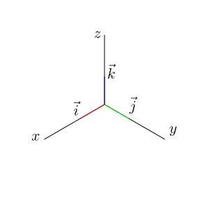

# 数学基础(一）
----

## 1. 基础约定

### 1.1 坐标系

#### 1.1.1 左手坐标系  

DirectX一般缺省使用左手坐标系

#### 1.1.2 右手坐标系

OpenGL缺省使用右手坐标系，图形学中缺省使用这种坐标系
### 1.2 左乘和右乘
#### 1.2.1 左乘，前乘(pre-multiply)
矢量为行向量，和矩阵的乘法为
$$
[x,y,z]\begin{bmatrix}
M_{11}&M_{12}&M_{13} \\
M_{21}&M_{22}&M_{23} \\
M_{31}&M_{32}&M_{33}
\end{bmatrix}
$$
DirectX缺省使用左乘

#### 1.2.2 右乘，后乘(post-multiply)
矢量为列向量，和矩阵的乘法为
$$
\begin{bmatrix}
M_{11}&M_{12}&M_{13} \\
M_{21}&M_{22}&M_{23} \\
M_{31}&M_{32}&M_{33}
\end{bmatrix}\begin{bmatrix}
x\\
y\\
z
\end{bmatrix}
$$
OpenGL缺省使用右乘，图形学中缺省使用这种方式。

### 1.3 行存储和列存储
#### 1.3.1 行存储
在计算机内存中，按照行优先存储一个矩阵，DirectX使用这种方式
比如对于矩阵
$$
\begin{bmatrix}
M_{11}&M_{12}&M_{13} \\
M_{21}&M_{22}&M_{23} \\
M_{31}&M_{32}&M_{33}
\end{bmatrix}
$$
在内存中为$M_{11},M_{12},M_{13},M_{21},M_{22}\ldots$

#### 1.3.2 列存储
按照列优先存储一个矩阵，OpenGL使用这种方式
比如对于矩阵
$$
\begin{bmatrix}
M_{11}&M_{12}&M_{13} \\
M_{21}&M_{22}&M_{23} \\
M_{31}&M_{32}&M_{33}
\end{bmatrix}
$$
在内存中为$M_{11},M_{21},M_{31},M_{12},M_{22}\ldots$

## 2. 矢量
### 2.1 基本操作
#### 2.1.1 定义
$$
\begin{split}
\vec{u}&=[u_x,u_y,u_z]^T, \vec{v}=[v_x,v_y,v_z]^T \\
\vec{u}\pm\vec{v}&=[u_x\pm v_x, u_y\pm v_y, u_z\pm v_z]^T \\
k\vec{u}&=[ku_x, ku_y, ku_z]^T \\
\end{split}
$$
#### 2.1.2 几何意义

### 2.2 标准矢量

标准矢量(Standard Basis)，定义$\vec{\boldsymbol i}=[1,0,0]^T, \vec{\boldsymbol j}=[0,1,0]^T, \vec{\boldsymbol k}=[0,0,1]^T$

### 2.3 长度
#### 2.3.1 定义
对于三维矢量$\vec{u}$，定义矢量的长度
$$
\|\vec{u}\|=\sqrt{u_x^2+u_y^2+u_z^2}
$$
有时候矢量的长度也可以用$|\vec{u}|$表示，但容易和绝对值混淆
#### 2.3.2 定义
对于三维矢量$\vec{u}$，定义矢量的单位矢量
$$
\hat{\vec{u}}=\frac{\vec{u}}{\|\vec{u}\|}=(\frac{u_x}{\|\vec{u}\|}, \frac{u_y}{\|\vec{u}\|}, 
\frac{u_z}{\|\vec{u}\|})
$$
### 2.4 点积
#### 2.4.1 定义
对于两个三维矢量$\vec{u}, \vec{v}$，定义它们的点积([Dot Product](https://en.wikipedia.org/wiki/Dot_product))为
$$
\vec{u}\cdot\vec{v}=u_xv_x+u_yv_y+u_zv_z
$$

#### 2.4.2 点积的几何意义

$$
\vec{a}\cdot\vec{b}=\|\vec{a}\|\|\vec{b}\|\cos{\theta}
$$
两个向量的点积可以看成两个向量相近的程度，向量和自身的点积是向量长度的平方
$$
\vec{u}\cdot\vec{u}=\|\vec{u}\|\|\vec{u}\|=u_x^2+u_y^2
$$
向量$\vec{a}$在向量$\vec{b}$上的投影的长度为
$$
a_b=\frac{\vec{a}\cdot\vec{b}}{\|b\|}
$$

#### 2.4.3 推论
判断两个矢量$\vec{\boldsymbol u},\vec{\boldsymbol v}$之间的夹角和它们之间点积的关系
$$
\cos(\theta)=\frac{\vec{\boldsymbol u}\cdot \vec{\boldsymbol v}}{\|\vec{\boldsymbol u}\|\|\vec{\boldsymbol v}\|}
$$
- 当$\vec{u}\cdot\vec{v}\gt 0$，夹角在[0,90)之间
- 当$\vec{u}\cdot\vec{v}=0$，两个矢量垂直
- 当$\vec{u}\cdot\vec{v}\lt 0$，两个矢量夹角在(90,180]之间

#### 2.4.3 基本运算规则
矢量的点积满足一般的交换律、分配律
- $\vec{a}\cdot\vec{b}=\vec{b}\cdot\vec{a}$
- $\vec{a}\cdot(\vec{b}+\vec{c}) = \vec{a}\cdot\vec{b}+\vec{a}\cdot\vec{c}$
- $(k\vec{a})\cdot\vec{b}=\vec{a}\cdot(k\vec{b})=k(\vec{a}\cdot\vec{b})$

### 2.5叉积
#### 2.5.1 定义
对于两个三维矢量$\vec{a}, \vec{b}$，定义它们的叉积
$$\begin{aligned}
\vec{\boldsymbol a}\times\vec{\boldsymbol b}&=\begin{vmatrix}
\vec{\boldsymbol i}& \vec{\boldsymbol j} & \vec{\boldsymbol k}\cr
a_x   & a_y & a_z \cr
b_x & b_y & b_z
\end{vmatrix}\\
&=(a_yb_z-a_zb_y)\vec{\boldsymbol{i}}+(a_zb_x-a_xb_z)\vec{\boldsymbol{j}}+(a_xb_y-a_yb_x)\vec{\boldsymbol{k}}
\end{aligned}
$$
#### 2.5.2 叉积的几何意义
在三维几何中，向量a和向量b的叉乘结果是一个向量，更为熟知的叫法是法向量，该向量垂直于a和b向量构成的平面。

定义向量$\vec{\boldsymbol n}$是一个单位向量，方向同时垂直于向量$\vec{\boldsymbol u}$和$\vec{\boldsymbol v}$，且符合右手定则（右手坐标系），那么
$$
\vec{\boldsymbol u}\times\vec{\boldsymbol v}=\|\vec{\boldsymbol u}\|\|\vec{\boldsymbol v}\|\sin(\theta)\vec{\boldsymbol n}
$$
向量a和向量b的叉积还可以视作以$\vec{a}$和$\vec{b}$为边的平行四边形的面积

#### 2.5.3 基本运算规则
- $\vec{a}\times\vec{b}=-\vec{b}\times\vec{a}$
- $\vec{a}\times\vec{a}=\vec{0}$
- $\vec{a}\times(\vec{b}+\vec{c})=\vec{a}\times\vec{b}+\vec{a}\times\vec{c}$
- $\vec{a}\times(k\vec{b})=k(\vec{a}\times\vec{b})$

#### 2.5.4 叉积的矩阵形式
两个向量的叉积，可以表达成一个矩阵和向量的乘积的形式，例如向量$\vec{a}$和$\vec{b}$的叉积
$$
\vec{a}\times\vec{b}=\begin{bmatrix}
{(\vec{a}\times\vec{b}})_{x}\\
{(\vec{a}\times\vec{b}})_{y}\\
{(\vec{a}\times\vec{b}})_{z}
\end{bmatrix}=\begin{bmatrix}
a_yb_z-a_zb_y\\
a_zb_x-a_xb_z\\
a_xb_y-a_yb_x
\end{bmatrix}=\begin{bmatrix}
0&-a_z&a_y\\
a_z&0&-a_x\\
-a_y&a_x&0
\end{bmatrix}\begin{bmatrix}
b_x\\b_y\\b_z
\end{bmatrix}
$$
这里称这个矩阵为矢量$\vec{a}$的叉乘矩阵[cross-product matrix](https://en.wikipedia.org/wiki/Cross_product#Conversion_to_matrix_multiplication)，写作$[\boldsymbol{a}]_{\times}$
$$
[\boldsymbol{a}]_{\times}\overset{def}{=}\begin{bmatrix}
0&-a_z&a_y\\
a_z&0&-a_x\\
-a_y&a_x&0
\end{bmatrix}
$$
### 2.6 混合积
对于三个矢量$\vec{a},\vec{b},\vec{c}$，定义混合积为
$$
(\vec{a}\times\vec{b})\cdot\vec{c}
$$
混合积满足
$$
(\vec{a}\times\vec{b})\cdot\vec{c}=(\vec{b}\times\vec{c})\cdot\vec{a}=(\vec{c}\times\vec{a})\cdot\vec{b}
$$

#### 2.6.1 混合积的几何意义
如图，以三个矢量为边的棱作平行六面体，$\|\vec{a}\times\vec{b}\|$可以视作以$\vec{a}$和$\vec{b}$为边的平行四边形的面积，$(\vec{a}\times\vec{b})\cdot\vec{c}$可以视作这个平行六面体的体积

### 2.7 三重积
对于三个矢量$\vec{a},\vec{b},\vec{c}$，有如下公式
$$
\vec{a}\times(\vec{b}\times\vec{c})=(\vec{a}\cdot\vec{c})\vec{b}-(\vec{a}\cdot\vec{b})\vec{c}\tag{2.6.1}
$$
证明：  
设$\vec{d}=\vec{a}\times(\vec{b}\times\vec{c})$，可知$\vec{d}$垂直于$\vec{b}$和$\vec{c}$所组成的平面的法线，也就是$\vec{d}$平行于$\vec{b}$和$\vec{c}$所组成的平面。所以$\vec{d}$可以表达成$\vec{b}$和$\vec{c}$的线性组合
$$
\vec{d}=m\vec{b}+n\vec{c}
$$
由于$\vec{d}$垂直于$\vec{a}$，所以
$$\begin{split}
\vec{a}\cdot(m\vec{b}+n\vec{c})&=0\\
m(\vec{a}\cdot\vec{b})+n(\vec{a}\cdot\vec{c})&=0
\end{split}$$
所以一定存在一个非零的实数$p$，使得$m=p(\vec{a}\cdot\vec{c}), n=-p(\vec{a}\cdot\vec{b})$，所以
$$
\vec{d}=\vec{a}\times(\vec{b}\times\vec{c})=p(\vec{a}\cdot\vec{c})\vec{b}-p(\vec{a}\cdot\vec{b})\vec{c}
$$
由于这是一个恒等式,$p$的值和$\vec{a},\vec{b},\vec{c}$无关，当特殊情况$\vec{a}=\vec{c}$时，有
$$
\vec{a}\times(\vec{b}\times\vec{a})=p(\vec{a}\cdot\vec{a})\vec{b}-p(\vec{a}\cdot\vec{b})\vec{a}
$$
两边同时点积$\vec{b}$，可以得到
$$
\vec{a}\times(\vec{b}\times\vec{a})\cdot\vec{b}=p(\vec{a}\cdot\vec{a})(\vec{b}\cdot\vec{b})-p(\vec{a}\cdot\vec{b})(\vec{a}\cdot\vec{b})
$$
等号左侧应用混合积公式，可以得到
$$\begin{split}
\vec{a}\times(\vec{b}\times\vec{a})\cdot\vec{b}&=(\vec{b}\times\vec{a})\cdot(\vec{b}\times\vec{a})\\
&=\|a\|^2\|b\|^2sin^2(\theta)
\end{split}$$
等号右侧
$$\begin{split}
p(\vec{a}\cdot\vec{a})(\vec{b}\cdot\vec{b})-p(\vec{a}\cdot\vec{b})(\vec{a}\cdot\vec{b})&=p\|a\|^2\|b\|^2-p\|a\|^2\|b\|^2cos^2(\theta)\\
&=p\|a\|^2\|b\|^2(1-cos^2(\theta))\\
&=p\|a\|^2\|b\|^2sin^2(\theta)
\end{split}$$
由此可得$p=1$