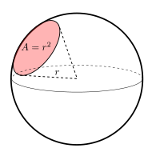
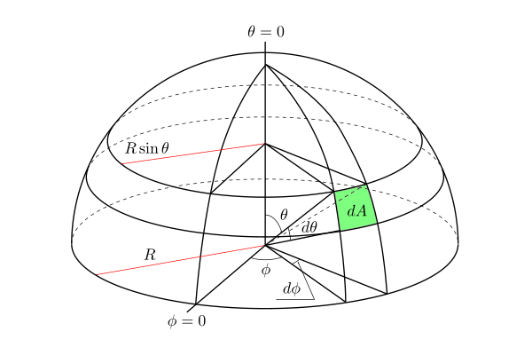

# 数学基础(三）
----
## 4. 立体角
### 4.1 定义
三维空间的弧度，以r为半径的球，在球表面面积为$A=r^2$的圆对应的立体角为**单位立体角**，

### 4.2 和平面角的对应关系
下图中方形面积对应的立体角为
$$
d\omega=\dfrac{dA}{R^2}=\dfrac{R\sin\theta d\phi\times R d\theta}{R^2}=\sin\theta d\phi d\theta
$$

### 4.3 积分
针对立体角的半球体积分可以转换为球面角
$$
\int_{\Omega}f(\vec{\omega})d\omega=\int_{0}^{2\pi}\int_{0}^{\pi/2}f(\theta,\phi)\sin\theta d\theta d\phi
$$
比如求半球体的面积
$$
\int_{\Omega}d\omega=\int_{0}^{2\pi}\int_{0}^{\pi/2}\sin\theta d\theta d\phi=2\pi
$$