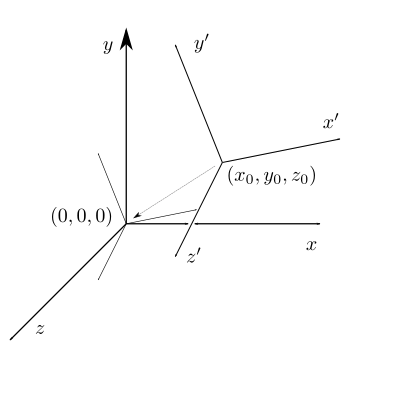

# 几何变换（二）
----
## 4. 仿射变换

### 4.1 齐次坐标(Homogeneous Coordinates)

#### 4.1.1 定义
齐次坐标就是将一个原本是n维的向量或者一个n维的点用一个n+1维坐标来表示，例如二维点$[x,y]$,用$[x,y,w]$表示，它等同于笛卡尔坐标系中的$[x/w,y/w]$
$$
[x,y,w]\Leftrightarrow[\frac{x}{w},\frac{y}{w}]
$$

#### 4.1.2 齐次的含义
笛卡尔坐标$[x,y]$，等同于齐次坐标$[kx,ky,k]$，所以称作该坐标是"齐次"，Homogeneous一词有“同质”的含义，译作同质坐标可能更准确一些

#### 4.1.3 点和矢量
在图形学中，一般用$[x,y,0]$表示一个二维矢量，用$[x,y,z,1]$表示一个二维点。 这样可以保证矢量的“平移不变性”，也就是一个矢量经过平移变换，仍然保持和原先一致。
$$
\begin{bmatrix}
1&0&t_x\\
0&1&t_y\\
0&0&1
\end{bmatrix}\begin{bmatrix}x\\y\\0\end{bmatrix}=\begin{bmatrix}x\\y\\0\end{bmatrix}
$$
两个矢量的和或者差$\vec{\boldsymbol{u}}\pm\vec{\boldsymbol{v}}=[u_x,u_y,u_z,0]\pm[v_x,v_y,v_z,0]=[u_x\pm v_x,u_y\pm v_y,u_z\pm v_z,0]$仍然是一个矢量，而两个点的差也是矢量，点和矢量的和或者差也是矢量
$$\begin{split}
{vector}+{vector}&={vector} \\
{point}-{point}&={vector} \\
{point}+{point}&={?} \\
{point}+{vector}&={point} \\
\end{split}$$
其次坐标表示的两个点的和也是有意义的，表示两个点的中点
$$
[x_1,y_1,1]+[x_2,y_2,1]=[x_1+x_2,y_1+y_2,2]=[\frac{x_1+x_2}{2}, \frac{y_1+y_2}{2}, 1]
$$

### 4.2 齐次矩阵表达
#### 4.2.1 线性变换无法表示图形学中所有的几何变换，因此需要定义一种变换为
$$
\alpha(\vec{\boldsymbol{v}})=\tau(\vec{\boldsymbol{v}})+\vec{\boldsymbol{b}}
$$
用矩阵表达为
$$\begin{split}
\alpha(\vec{\boldsymbol{v}})&=\boldsymbol{A}\vec{\boldsymbol{v}}+\vec{\boldsymbol{b}} \\
&=\begin{bmatrix}
A_{11}&A_{12}&A_{13}\\
A_{21}&A_{22}&A_{23}\\
A_{31}&A_{32}&A_{33}
\end{bmatrix}\begin{bmatrix}x\\y\\z\end{bmatrix}+\begin{bmatrix}b_x\\b_y\\b_z\end{bmatrix}
&=\begin{bmatrix}x'\\y'\\z'\end{bmatrix}
\end{split}$$
常用4X4齐次矩阵来做这种运算
$$
\begin{bmatrix}
A_{11}&A_{12}&A_{13}&b_x\\
A_{21}&A_{22}&A_{23}&b_y\\
A_{31}&A_{32}&A_{33}&b_z\\
0&0&0&1
\end{bmatrix}\begin{bmatrix}x\\y\\z\\1\end{bmatrix}=\begin{bmatrix}x'\\y'\\z'\\1\end{bmatrix}
$$

## 5. 平移变换

### 5.1 定义
空间中的某一点$\boldsymbol u$，移动到$\boldsymbol{u}+\vec{\boldsymbol{b}}$，那么用齐次矩阵表示这个变换为
$$
\boldsymbol T=\begin{bmatrix}
1&0&0&b_x \\
0&1&0&b_y \\
0&0&1&b_z \\
0&0&0&1
\end{bmatrix}
$$

## 6. 组合变换

### 6.1 定义
图形学中将所有变换统一使用4X4的齐次坐标组合
$$
R=R_n\cdots R_3R_2R_1 
$$
这样，一系列变换可以组合到一个矩阵中完成
$$
\cdots(R_3(R_2(R_1\vec{\boldsymbol{u}}))=(\cdots R_3R_2R_1)\vec{\boldsymbol{u}}
$$

### 6.2 坐标系变换
一个物体在不同坐标系中的变换，比如常用的局部坐标系到世界坐标系的变换

设新坐标系x'y'z'的原点在原坐标系的$\vec{\boldsymbol{O}}(x_o,y_o,z_o)$处，新坐标系的单位坐标矢量在原坐标系中的矢量为$\vec{\boldsymbol{i}'},\vec{\boldsymbol{j}'},\vec{\boldsymbol{k}'}$，那么将物体的坐标从原先坐标系xyz转换到新坐标系x'y'z'的转换可以分为两部分
#### 6.2.1 平移矩阵
构建平移矩阵，目的是将物体在原坐标系中的坐标做一个偏移，这个偏移可以视作将物体和新坐标系一起移动，将新坐标系的原点$\boldsymbol{O}$挪到原坐标系的原点处，可以得到

$$
\boldsymbol{T}=\begin{bmatrix}
1&0&0&-x_0 \\
0&1&0&-y_0 \\
0&0&1&-z_0 \\
0&0&0&1
\end{bmatrix}
$$
#### 6.2.2 构建旋转矩阵
接下来要构建一个旋转矩阵$\boldsymbol{R}$，目的是将片以后的物体坐标和新坐标系旋转到和原坐标系一致，也就是经过这个矩阵，可以将新坐标系中的$x'$轴旋转到原坐标系的$x$轴，也就是:
$$
\boldsymbol{R}\begin{bmatrix}i_x'\\i_y'\\i_z'\\0\end{bmatrix}=\begin{bmatrix}1\\0\\0\\0\end{bmatrix}
$$
同理，也需要将$y'$轴旋转到$y$轴，$z'$轴旋转到$z$轴

这个矩阵并不好直接写出，但是它的逆矩阵就比较容易，也就是能够将写出
$$
\boldsymbol{R}^{-1}=\begin{bmatrix}
i_x'&j_x'&k_x'&0 \\
i_y'&j_y'&k_y'&0 \\
i_z'&j_z'&k_z'&0 \\
0&0&0&1
\end{bmatrix}
$$
这个矩阵满足
$$\begin{split}
\boldsymbol{R}^{-1}[1,0,0,0]^T&=[i_x',i_y',i_z',0]^T\\
\boldsymbol{R}^{-1}[0,1,0,0]^T&=[j_x',j_y',j_z',0]^T\\
\boldsymbol{R}^{-1}[0,0,1,0]^T&=[k_x',k_y',k_z',0]^T
\end{split}$$
由于这是一个正交矩阵，所以
$$
\boldsymbol{R}=(\boldsymbol{R}^{-1})^T=\begin{bmatrix}
i_x'&i_y'&i_z'&0 \\
j_x'&j_y'&j_z'&0 \\
k_x'&k_y'&k_z'&0 \\
0&0&0&1
\end{bmatrix}
$$
#### 6.2.3 组合后的坐标转换矩阵
$$\begin{split}
\boldsymbol{RT}&=\begin{bmatrix}
i_x'&i_y'&i_z'&-(x_0i_x'+y_0i_y'+z_0i_z') \\
j_x'&j_y'&j_z'&-(x_0j_x'+y_0j_y'+z_0j_z') \\
k_x'&k_y'&k_z'&-(x_0k_x'+y_0k_y'+z_0k_z') \\
0&0&0&1
\end{bmatrix}\\&=\begin{bmatrix}
i_x'&i_y'&i_z'&-\vec{O}\cdot\vec{i'} \\
j_x'&j_y'&j_z'&-\vec{O}\cdot\vec{j'} \\
k_x'&k_y'&k_z'&-\vec{O}\cdot\vec{k'} \\
0&0&0&1
\end{bmatrix}\end{split}
$$
验证
$$\begin{split}
\boldsymbol{RT}[i_x',i_y',i_z',0]^T&=[1,0,0,0]^T\\
\boldsymbol{RT}[j_x',j_y',j_z',0]^T&=[0,1,0,0]^T\\
\boldsymbol{RT}[k_x',k_y',k_z',0]^T&=[0,0,1,0]^T\\
\boldsymbol{RT}[x_0,y_0,z_0,1]^T&=[0,0,0,1]^T
\end{split}$$