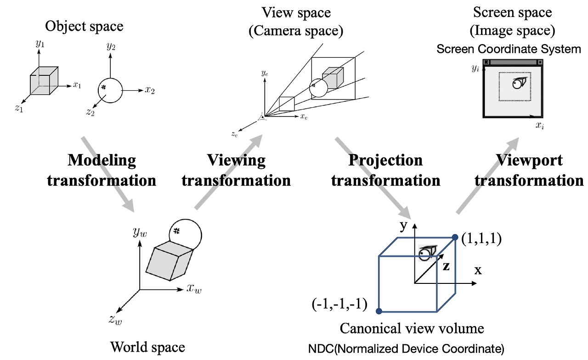
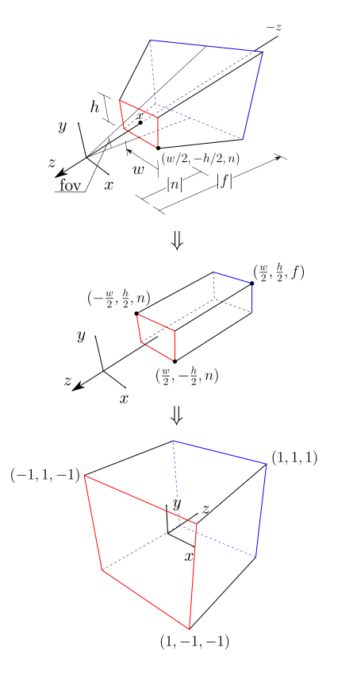
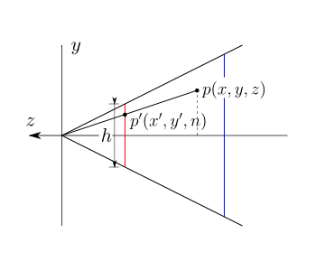
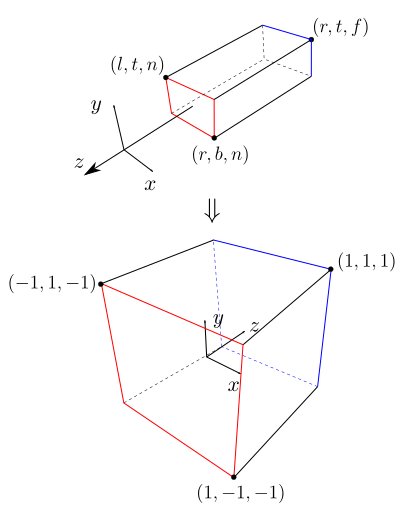

# 几何变换(四）
----
## 8. 视图变换管线概览
一个物体从独立的物体最终转换为2D图像，期间经过如下坐标变换

 * Modeling transformation: 由局部坐标系(Local Space)转换为世界坐标系(World Space)
 * Viewing transformation: 由世界坐标系(World Space)转换为摄像机坐标系(View Space)
 * Projection transformation: 由摄像机坐标系（View Space)转换为标准设备坐标系NDC(Normalized Device Coordinate) 
 * Viewport transformation: 由NDC坐标系转换为视口坐标系(Screen coordinate System)

## 9. 摄像机视图变换（Viewing/Camera Transformation)

### 9.1 定义
视图变换是将物体的世界坐标系转换到摄像机的坐标系

摄像机坐标系以观察点(eye)为原点，向前方向为-z轴，x轴指向右侧（右手坐标系）
所以
$$\begin{split}
\vec{\boldsymbol{z}}'&=lookat-eye\\
\vec{\boldsymbol{x}}'&=\vec{up}\times\vec{\boldsymbol{z}}' \\
\vec{\boldsymbol{y}}'&=\vec{\boldsymbol{z}}'\times\vec{\boldsymbol{x}}' 
\end{split}$$

### 9.2 计算
根据[坐标系变换公式](/note/graphics/math/transform_02.html#_6-2-3-%E7%BB%84%E5%90%88%E5%90%8E%E7%9A%84%E5%9D%90%E6%A0%87%E8%BD%AC%E6%8D%A2%E7%9F%A9%E9%98%B5)，设摄像机在世界坐标系中的位置为$e$，摄像机的三个轴的单位轴向量为$\vec{\boldsymbol{i}'}, \vec{\boldsymbol{j}'}, \vec{\boldsymbol{k}'}$视图变换矩阵为
$$
M_{view}=\begin{bmatrix}
i_x'&i_y'&i_z'&-\vec{\boldsymbol{e}}\cdot\vec{\boldsymbol{i}}' \\
j_x'&j_y'&j_z'&-\vec{\boldsymbol{e}}\cdot\vec{\boldsymbol{j}}' \\
k_x'&k_y'&k_z'&-\vec{\boldsymbol{e}}\cdot\vec{\boldsymbol{k}}' \\
0&0&0&1
\end{bmatrix}
$$

## 10. 透视投影变换(Perspective Projective Transformations)

### 10.1 定义
投影变换是将物体从摄像机坐标系转换到标准设备坐标系(NDC)，也就是坐标值在一个$[-1,1]^3$的盒子里(Canonical view volume)
可以将这个过程分为两步，首先构造一个坐标转换，将摄像机的摄影范围构成的视锥体(Frustum)变形成一个立方体(Cuboid)，然后再将这个立方体转化为成标准设备坐标系下(NDC)的标准观察体CCV(Canonical View Volume)

NDC坐标系在不同的系统上有不同的约定，在DirectX中，近平面到远平面映射到$[0,1]$，在OpenGL则是把近平面到远平面映射到$[-1,1]$，但一般都把NDC坐标系设为左手坐标系。

### 10.2 求解过程

#### 10.2.1 从视锥体到立方体

设摄像机坐标系中的点$p(x,y,z)$，转换后的坐标为$(x',y',z')$，由定义可知$p$投影到摄像机近裁剪面上的点为$p'(x',y')$，由相似三角形可知
$$\begin{split}
y'&=\frac{ny}{z}\\
x'&=\frac{nx}{z}
\end{split}$$
设这个转换矩阵为$\boldsymbol{M}_{\text{persp}\rightarrow\text{ortho}}$, 可知
$$
\boldsymbol{M}_{\text{persp}\rightarrow\text{ortho}}\begin{bmatrix}
x\\y\\z\\1\end{bmatrix}=\begin{bmatrix}
\frac{nx}{z}\\\frac{ny}{z}\\z'\\1\end{bmatrix}
$$
对于表示一个点的其次坐标，所有数值乘以一个同样的数，所表达的意义相同，所以$[nx/z,ny/z,z',1]=[nx,ny,z'z,z]$，这里先暂时忽略$z$轴，可以得到
$$
\boldsymbol{M}_{\text{persp}\rightarrow\text{ortho}}\begin{bmatrix}
x\\y\\z\\1\end{bmatrix}=\begin{bmatrix}
nx\\ny\\?\\z\end{bmatrix}
$$
由此可以推断出，这个矩阵的第1，2和4行
$$
\begin{bmatrix}
n&0&0&0\\
0&n&0&0\\
?&?&?&?\\
0&0&1&0
\end{bmatrix}\begin{bmatrix}
x\\y\\z\\1\end{bmatrix}=\begin{bmatrix}
nx\\ny\\?\\z\end{bmatrix}
$$
考虑特殊情况，近平面上的任意一点$[x,y,n]$经过这个矩阵转换后
$$
\begin{bmatrix}
n&0&0&0\\
0&n&0&0\\
?&?&?&?\\
0&0&1&0
\end{bmatrix}\begin{bmatrix}
x\\y\\n\\1\end{bmatrix}=\begin{bmatrix}
nx\\ny\\?\\n\end{bmatrix}
$$
由于近平面上的点经过转换后坐标不变，所以$[nx,ny,?,n]=[x,y,n,1]$，而$[x,y,n,1]$作为其次坐标，所有数值都乘以$n$，可以得到$[x,y,n,1]==[nx,ny,n^2,n]$，所以
$$
\begin{bmatrix}
n&0&0&0\\
0&n&0&0\\
?&?&?&?\\
0&0&1&0
\end{bmatrix}\begin{bmatrix}
x\\y\\n\\1\end{bmatrix}=\begin{bmatrix}
nx\\ny\\n^2\\n\end{bmatrix}
$$
同理，远平面上的任意一个点$[x,y,f,1]$转换后为$[x',y',f,1]$，可以得到
$$
\begin{bmatrix}
n&0&0&0\\
0&n&0&0\\
?&?&?&?\\
0&0&1&0
\end{bmatrix}\begin{bmatrix}
x\\y\\f\\1\end{bmatrix}=\begin{bmatrix}
x'\\y'\\f^2\\n\end{bmatrix}
$$
由此可知，第三行的数值和$x,y$无关，一定是形如$[0,0,A,B]$这样的形式，且
$$\begin{split}
An+B=n^2\\
Af+B=f^2
\end{split}$$
可以得到
$$\begin{split}
A&=f+n\\
B&=-nf
\end{split}$$
得到这个转换矩阵为
$$
\boldsymbol{M}_{\text{persp}\rightarrow\text{ortho}}=\begin{bmatrix}
n&0&0&0\\
0&n&0&0\\
0&0&f+n&-nf\\
0&0&1&0
\end{bmatrix}
$$
#### 10.2.2 从立方体到标准观察体
这一步相对简单很多，只要将观察体的中心的$z$挪到原点，做一定的放缩，并且将$z$轴反转即可
$$\begin{split}
\boldsymbol{M}_{\text{ortho}\rightarrow\text{ccv}}&=\begin{bmatrix}
1&0&0&0\\
0&1&0&0\\
0&0&-1&0\\
0&0&0&1
\end{bmatrix}\begin{bmatrix}
2/w&0&0&0\\
0&2/h&0&0\\
0&0&2/(n-f)&0\\
0&0&0&1
\end{bmatrix}\begin{bmatrix}
1&0&0&0\\
0&1&0&0\\
0&0&1&-(n+f)/2\\
0&0&0&1
\end{bmatrix}\\
&=\begin{bmatrix}
2/w&0&0&0\\
0&2/h&0&0\\
0&0&-2/(n-f)&(n+f)/(n-f)\\
0&0&0&1
\end{bmatrix}
\end{split}$$
#### 10.2.3 合并后的矩阵
最终得到合并后的投影矩阵为
$$
\begin{aligned}
\boldsymbol{M}_{\text{persp}\rightarrow\text{ccv}}&=\boldsymbol{M}_{\text{ortho}\rightarrow\text{ccv}}\boldsymbol{M}_{\text{persp}\rightarrow\text{ortho}}\\
&=\begin{bmatrix}
\frac{2n}{w}&0&0&0\\
0&\frac{2n}{h}&0&0\\
0&0&-\frac{n+f}{n-f}&\frac{2nf}{n-f}\\
0&0&1&0
\end{bmatrix}
\end{aligned}
$$
在大部分工程项目中，摄像机的输入参数一般是如下几个
 * 宽高比 $aspect=w/h$
 * 视场角fov，$\tan(fov/2)=-h/2n$
 * 近裁剪距离 $near=\left|n\right|=-n$
 * 远裁剪距离 $far=\left|f\right|=-f$

将这些值带入上面的公式，可以得到
$$
\boldsymbol{M}_{\text{persp}\rightarrow\text{ccv}}=\begin{bmatrix}
\frac{-1}{\text{aspect}.\tan(fov/2)}&0&0&0\\
0&\frac{-1}{\tan(fov/2)}&0&0\\
0&0&-\frac{near+far}{near-far}&\frac{-2near.far}{near-far}\\
0&0&1&0
\end{bmatrix}
$$
一般来说，当针对一个空间点做矩阵转换时，如果$\boldsymbol{M}[u_x, u_y, u_z, 1]^T=[v_x,v_y,v_z,1]^T$，那么
$$
(k\boldsymbol{M})[u_x, u_y, u_z, 1]^T=k[v_x,v_y,v_z,1]^T=[kv_x,kv_y,kv_z,k]^T=[v_x,v_y,v_z,1]^T
$$
可知$k\boldsymbol{M}$在针对空间点转换矩阵中等同于$\boldsymbol{M}$，所以为了表达方便，经常将上面得到的这个矩阵乘以-1，得到
$$
\boldsymbol{M}_{\text{persp}\rightarrow\text{ccv}}=\begin{bmatrix}
\frac{1}{\text{aspect}.\tan(fov/2)}&0&0&0\\
0&\frac{1}{\tan(fov/2)}&0&0\\
0&0&\frac{near+far}{near-far}&\frac{2near.far}{near-far}\\
0&0&-1&0
\end{bmatrix}
$$
#### 10.2.4 深度插值

设摄像机坐标系中有一个线段$(x_1,z_1),(x_2,z_2)$，在摄像机近平面上的投影为$(x_1',n),(x_2',n)$，线段上有一点为$(x,z)$，投影为$(x',n)$
可知
$$\begin{split}
\frac{x}{x'}=\frac{z}{n}\\
x=\frac{zx'}{n}
\end{split}$$
设线段的方程为$ax+bz=c$，带入可得
$$\begin{split}
a\frac{zx'}{n}+bz=c \\
\frac{1}{z}=\frac{ax'}{cn}+\frac{b}{c}
\end{split}$$
当投影点$x'$在投影线段上线性移动时，$x'=(1-t)x_1'+tx_2'$，可得
$$\begin{split}
\frac{1}{z}&=\frac{a}{cn}\left((1-t)x_1'+tx_2'\right)+\frac{b}{c} \\
&=(\frac{ax_1'}{cn}+\frac{b}{c})(1-t)+(\frac{ax_2'}{cn}+\frac{b}{c})t \\
&=\frac{1}{z_1}(1-t)+\frac{1}{z_2}t
\end{split}$$
也就是说，当投影点$x'$在投影线段上线性移动时，原线段上的点的深度值的倒数是线性变换的

## 11. 正交投影变换(Orthogonal Projection Transformations)

### 11.1 定义

正交投影没有“远大近小”的效果

### 11.2 求解过程
相比透视投影，正交投影只需要将一个立方体形状的摄影范围最终映射到标准设备坐标系(NDC)下的一个标准立方体(Cuboid)即可
$$\begin{split}
\boldsymbol{M}_{\text{ortho}\rightarrow\text{ccv}}&=\begin{bmatrix}
1&0&0&0\\
0&1&0&0\\
0&0&-1&0\\
0&0&0&1
\end{bmatrix}\begin{bmatrix}
2/(r-l)&0&0&0\\
0&2/(t-b)&0&0\\
0&0&2/(n-f)&0\\
0&0&0&1
\end{bmatrix}\begin{bmatrix}
1&0&0&-(l+r)/2\\
0&1&0&-(t+b)/2\\
0&0&1&-(n+f)/2\\
0&0&0&1
\end{bmatrix}\\
&=\begin{bmatrix}
2/(r-l)&0&0&(l+r)/(l-r)\\
0&2/(t-b)&0&(b+t)/(b-t)\\
0&0&-2/(n-f)&(n+f)/(n-f)\\
0&0&0&1
\end{bmatrix}
\end{split}$$
同理，在工程中一般标注一个正交投影摄像机的主要参数如下
 * 近裁剪距离 $near=\left|n\right|=-n$
 * 远裁剪距离 $far=\left|f\right|=-f$
 * 左侧裁剪面坐标 $left=l$
 * 右侧裁剪面坐标 $left=l$
 * 上侧裁剪面坐标 $top=t$
 * 下侧裁剪面坐标 $bottom=t$
带入上面的公式可以得到
$$
\boldsymbol{M}_{\text{ortho}\rightarrow\text{ccv}}=\begin{bmatrix}
\frac{2}{right-left}&0&0&\frac{left+right}{left-right}\\
0&\frac{2}{top-bottom}&0&\frac{bottom+top}{bottom-top}\\
0&0&\frac{2}{near-far}&\frac{near+far}{near-far}\\
0&0&0&1
\end{bmatrix}
$$
