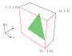

# 基础
----

## 1. 坐标系统

### 1.1 坐标系统
光栅化的本质，是将经过摄像机变换后物体从NDC坐标，转换到二维屏幕空间坐标系(screen space)，并离散成一个个像素点的过程。

屏幕空间的坐标系通常左下角为$(0,0)$点，$x$轴向右，$y$轴向上，每个像素可以视作1x1的小方块，像素的中心点的位置是像素左下角位置加上0.5

## 2. 三角形

### 2.1 顺时针和逆时针
在屏幕空间上，一个二维的三角形，可以使用3个二维坐标表示$P_1(x_1,y_1),P_2(x_2,y_2),P_3(x_3,y_3)$，按照这个顺序，可以分为逆时针(ccw)，顺时针(cw)两种情况

可以使用叉积来判断三个点的顺序是逆时针还是顺时针，如果$\overrightarrow{P_1P_2}\times\overrightarrow{P_2P_3}>0$，表示是逆时针，如果小于零则是顺时针，也就是$
(x_2-x_1)(y_3-y_2)-(y_2-y_1)(x_3-x_2)$是否大于$0$，在一般情况下，都是使用逆时针。

### 2.2 面积
根据[叉积的几何意义](../math/math_01.html#_2-5-2-%E5%8F%89%E7%A7%AF%E7%9A%84%E5%87%A0%E4%BD%95%E6%84%8F%E4%B9%89)，三角形面积同样可以利用叉积计算
$$
S_{\triangle}=\frac{1}{2}\|\vec{AB}\times\vec{AC}\|=\frac{1}{2}|(x_2−x_1)(y_3−y_1)−(y_2−y_1)(x_3−x_1)|
$$

### 2.3 重心坐标
给定三角形的三点坐标$A, B, C$，该平面内一点$P$可以写成这三点坐标的线性组合形式，即
$$
P=\alpha A+\beta B+\gamma C
$$
且满足$\alpha+\beta+\gamma=1$则称此时3个坐标$A,B,C$的权重$\alpha,\beta,\gamma$为点$P$的重心坐标

重心坐标用于将三角形三个顶点上的属性（例如UV,法线，定点色等）均匀过渡到三角形内的任一点，重心坐标可以使用面积的比值来求得

$$
\alpha=\frac{S_{\triangle PBC}}{S_{\triangle ABC}},\beta=\frac{S_{\triangle PAC}}{S_{\triangle ABC}},\gamma=\frac{S_{\triangle PAB}}{S_{\triangle ABC}},
$$

### 2.4 透视矫正
三角形上点的经过[透视投影变换](../math/transform_04.html#_10-%E9%80%8F%E8%A7%86%E6%8A%95%E5%BD%B1%E5%8F%98%E6%8D%A2-perspective-projective-transformations)后，重心坐标会发生变换

比如上面这个长方体的侧面，原先均匀分布的竖线，经过透视变换后，在屏幕上不再是均匀分布，说明重心坐标发生了变化。

设摄像机空间中的三角形$ABC$,经过透视投影矩阵$M$变换后，成为三角形$A'B'C'$，三角形上的点$P$变成$P'$，设$A$点的齐次坐标为$(A,1)^T$，$A'$点的齐次坐标为$(A'w_a,w_a)^T$，可知
$$
\begin{aligned}
\begin{bmatrix}A'w_a\\w_a\end{bmatrix}&=M\begin{bmatrix}A\\1\end{bmatrix}\\
\begin{bmatrix}B'w_b\\w_b\end{bmatrix}&=M\begin{bmatrix}B\\1\end{bmatrix}\\
\begin{bmatrix}C'w_c\\w_c\end{bmatrix}&=M\begin{bmatrix}C\\1\end{bmatrix}\\
\begin{bmatrix}P'w_p\\w_p\end{bmatrix}&=M\begin{bmatrix}P\\1\end{bmatrix}
\end{aligned}\tag{2.4.1}
$$
设$P$的重心坐标为$\alpha,\beta,\gamma$，经过透视投影变换后，$P'$的重心坐标为$\alpha',\beta',\gamma'$，可知
$$\begin{aligned}
P&=\alpha A+\beta B+\gamma C\\
P'&=\alpha' A'+\beta' B'+\gamma' C'
\end{aligned}\tag{2.4.2}
$$
由于$\alpha+\beta+\gamma=1$，可以推导出如下公式
$$
\begin{aligned}
\alpha\begin{bmatrix}A\\1\end{bmatrix}+\beta\begin{bmatrix}B\\1\end{bmatrix}+\gamma\begin{bmatrix}C\\1\end{bmatrix}&=
\begin{bmatrix}\alpha A\\\alpha\end{bmatrix}+\begin{bmatrix}\beta B\\\beta\end{bmatrix}+\begin{bmatrix}\gamma C\\\gamma\end{bmatrix}\\
&=\begin{bmatrix}\alpha A+\beta B+\gamma C\\\alpha+\beta+\gamma\end{bmatrix}\\
&=\begin{bmatrix}P\\1\end{bmatrix}
\end{aligned}
$$
代入2.4.1可以得到
$$
\begin{aligned}
\begin{bmatrix}P'w_p\\w_p\end{bmatrix}=M\begin{bmatrix}P\\1\end{bmatrix}&=M\left(\alpha\begin{bmatrix}A\\1\end{bmatrix}+\beta\begin{bmatrix}B\\1\end{bmatrix}+\gamma\begin{bmatrix}C\\1\end{bmatrix}\right)\\
&=\alpha M\begin{bmatrix}A\\1\end{bmatrix}+\beta M\begin{bmatrix}B\\1\end{bmatrix}+\gamma M\begin{bmatrix}C\\1\end{bmatrix}\\
&=\alpha\begin{bmatrix}A'w_a\\w_a\end{bmatrix}+\beta\begin{bmatrix}B'w_b\\w_b\end{bmatrix}+\gamma\begin{bmatrix}C'w_c\\w_c\end{bmatrix}\\
&=\begin{bmatrix}\alpha A'w_a+\beta B'w_b+\gamma C'w_c\\ \alpha w_a+\beta w_b+\gamma w_c\end{bmatrix}
\end{aligned}\tag{2.4.3}
$$
所以可以得到
$$
\begin{aligned}
P'w_p&=\alpha A'w_a+\beta B'w_b+\gamma C'w_c\\
w_p&=\alpha w_a+\beta w_b+\gamma w_c
\end{aligned}\tag{2.4.4}
$$
进一步求$P'$的重心坐标，根据2.4.4可以得到
$$
\begin{aligned}
P'&=\frac{\alpha w_a}{w_p}A'+\frac{\beta w_b}{w_p}B'+\frac{\gamma w_c}{w_p}C'\\
&=\frac{\alpha w_a}{\alpha w_a+\beta w_b+\gamma w_c}A'+\frac{\beta w_b}{\alpha w_a+\beta w_b+\gamma w_c}B'+\frac{\gamma w_c}{\alpha w_a+\beta w_b+\gamma w_c}C'
\end{aligned}\tag{2.4.5}
$$
可以得到
$$
\begin{cases}
\alpha'&=\displaystyle{\frac{\alpha w_a}{\alpha w_a+\beta w_b+\gamma w_c}}\\
\beta'&=\displaystyle{\frac{\beta w_b}{\alpha w_a+\beta w_b+\gamma w_c}}\\
\gamma'&=\displaystyle{\frac{\gamma w_c}{\alpha w_a+\beta w_b+\gamma w_c}}
\end{cases}
\tag{2.4.6}
$$
但是在光栅化过程中，需要计算的是从$P'$的重心坐标$(\alpha',\beta',\gamma')$推导出$P$的重心坐标$(\alpha,\beta,\gamma)$，首先设
$$
k=\frac{1}{\alpha w_a+\beta w_b+\gamma w_c}
$$
代入2.4.6可以得到
$$
\begin{cases}
\alpha'&=\alpha w_a k\\
\beta'&=\beta w_b k\\
\gamma'&=\gamma w_c k
\end{cases}
$$
$$
\begin{cases}
\alpha&=\displaystyle{\frac{\alpha'}{w_a k}}\\
\beta&=\displaystyle{\frac{\beta'}{w_b k}}\\
\gamma&=\displaystyle{\frac{\gamma'}{w_c k}}
\end{cases}\tag{2.4.7}
$$
由于$\alpha+\beta+\gamma=1$，所以将2.4.7中的$\alpha,\beta,\gamma$相加可以得到
$$
\begin{aligned}
1&=\frac{\alpha'}{w_a k}+\frac{\beta'}{w_b k}+\frac{\gamma'}{w_c k}\\
&=\left(\frac{\alpha'}{w_a}+\frac{\beta'}{w_b}+\frac{\gamma'}{w_c}\right)\frac{1}{k}
\end{aligned}
$$
求得$k$值为
$$
k=\frac{\alpha'}{w_a}+\frac{\beta'}{w_b}+\frac{\gamma'}{w_c}\tag{2.4.8}
$$
代入2.4.7，可以得到
$$
\begin{cases}
\alpha&=\frac{\displaystyle{\frac{\alpha'}{w_a}}}{\displaystyle{\frac{\alpha'}{w_a}+\frac{\beta'}{w_b}+\frac{\gamma'}{w_c}}}\\
\beta&=\frac{\displaystyle{\frac{\beta'}{w_b}}}{\displaystyle{\frac{\alpha'}{w_a}+\frac{\beta'}{w_b}+\frac{\gamma'}{w_c}}}\\
\gamma&=\frac{\displaystyle{\frac{\gamma'}{w_c}}}{\displaystyle{\frac{\alpha'}{w_a}+\frac{\beta'}{w_b}+\frac{\gamma'}{w_c}}}
\end{cases}\tag{2.4.9}
$$
观察以往推导出的[透视投影矩阵公式](../math/transform_04.html#_10-2-3-%E5%90%88%E5%B9%B6%E5%90%8E%E7%9A%84%E7%9F%A9%E9%98%B5)(10.2.3.2)
$$
\boldsymbol{M}=\begin{bmatrix}
\frac{1}{\text{aspect}\cdot\tan(fov/2)}&0&0&0\\
0&\frac{1}{\tan(fov/2)}&0&0\\
0&0&\frac{far}{near-far}&\frac{near\cdot far}{near-far}\\
0&0&-1&0
\end{bmatrix}
$$
可以看出，矩阵最后一行只有第3列是-1其他都是0，可以得知，这个矩阵生成的$w$值只和$z$有关，且$w=-z$，所以
$$
\begin{cases}
\alpha&=\frac{\displaystyle{\frac{\alpha'}{z_a}}}{\displaystyle{\frac{\alpha'}{z_a}+\frac{\beta'}{z_b}+\frac{\gamma'}{z_c}}}\\
\beta&=\frac{\displaystyle{\frac{\beta'}{z_b}}}{\displaystyle{\frac{\alpha'}{z_a}+\frac{\beta'}{z_b}+\frac{\gamma'}{z_c}}}\\
\gamma&=\frac{\displaystyle{\frac{\gamma'}{z_c}}}{\displaystyle{\frac{\alpha'}{z_a}+\frac{\beta'}{z_b}+\frac{\gamma'}{z_c}}}
\end{cases}\tag{2.4.10}
$$
