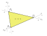
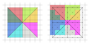

# 边界判定
----

## 4. 边界判定

### 4.1 边界函数(Edge Function)
设二维平面上的一条直线，上面有两个点$P_0(x_0,y_0)$和$P_1(x_1,y_1)$，这里假设直线的方向是从$P_0$到$P_1$，那么直线把整个二维平面分成两部分，“左边”和“右边”。那么对于这个平面上任意一点$P(x,y)$，定义二维函数
$$
\begin{aligned}
e(x,y)&=\|\vec{P_0P_1}\times\vec{P_0P}\| \\
&=(x_1-x_0)(y-y_0)-(y_1-y_0)(x-x_0)
\end{aligned}\tag{4.1.1}
$$
称这个函数为这条直线的边界函数(Edge Function)，当$e(x,y)>0$时，$P$位于直线的左侧，当$e(x,y)<0$时，$P$位于直线的右侧，当$e(x,y)=0$时，表示$P$恰好在直线上


### 4.2 判定三角形内外
对于逆时针排列三角形，如果一个点如果在三角形内，那么这个点一定在所有三条边的“左侧”，反之，只要有这个点出现在任意一条边的“右侧”，那么这个点就是在三角形的外部




### 4.3 判定三角形的边(Top-Left规则)
如果一个点出恰好现在三角形某个边上，也就是某个EdgeFunction的值恰好为零，需要根据Top-Left规则来判定这个点是否归属改三角形。 这是由于图形学中会出现两个三角形共享一条边的情况，而这种情况下边上的点应该只归属其中一个三角形，Top-Left是一个约定的规则：
>如果边出现三角形左侧或者恰好是水平方向最上面的边，则这种边属于这个三角形


例如上面的三角形，实线边是属于这个三角形的，虚线边则不属于。 DirectX的[光栅化规则](https://learn.microsoft.com/en-us/windows/win32/direct3d11/d3d10-graphics-programming-guide-rasterizer-stage-rules)也是遵守的这个规则


如果一个点是两个边的公有点，则只有在这两条边都是属于三角形的边的情况下，这个顶点才是属于这个三角形的，以保证在光栅化过程中，所有点都属于唯一的某个三角形，例如下面的一个比较极端的例子，对8个小三角形的光栅化



### 4.4 三角形内部判断
边界函数4.1.1可以变形为
$$\begin{aligned}
e(x,y)&=(x_1-x_0)(y-y_0)-(y_1-y_0)(x-x_0)\\
&=-(y_1-y_0)x+(x_1-x_0)y+(y_1-y_0)x_0-(x_1-x_0)y_0
\end{aligned}$$
如果设
$$
\begin{aligned}
a&=-(y_1-y_0)\\
b&=x_1-x_0\\
c&=(y_1-y_0)x_0-(x_1-x_0)y_0
\end{aligned}$$
则边界函数可以写作
$$
e(x,y)=ax+by+c\tag{4.4.1}
$$
结合上面对于是否在三角形内以及三角形边上的判断，最终判断某点是否属于三角形，使用下面的函数判断该点是否在三角形三个边的内部
```cpp :no-line-numbers
bool Inside(a,b,c, x, y) 
{
	bool is_top_left = (a!=0)?(a>0):(b<0);
	e=a*x+b*y+c;
	return e>0 || (e==0 && is_top_left);
}
```
如果这个点出现在三个边的内部，则该点在三角形内部
