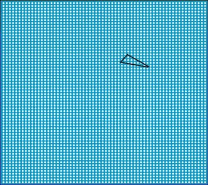
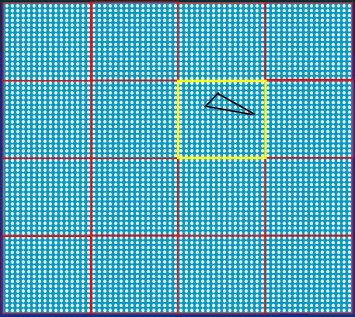
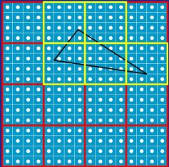
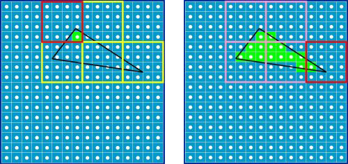
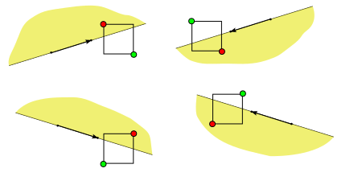
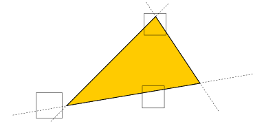

# 像素遍历
----

## 5. 像素遍历

像素遍历是指光栅化中重要的一个环节，是指找到三角形内部像素的过程，同时也要计算出像素对应的属性，比如颜色，深度等。

### 5.1 扫描线算法
(略...)

### 5.2 分块算法
分块算法是将绘制区域分成方块(Title)，逐个方块进行光栅化。 Title的大小最小为$4\times4$，逐级按照4倍递增，也就是$4\times4, 16\times16, 64\times64,...$，比如下面图中这个三角形所在的绘制区域，大小为$64\times64$，正好是一个Title。

将这个Title分成$4\times4$份，每份$16\times16$大小的方块, 计算有哪些方块被三角形覆盖

判定只有一个$16\times16$块碰触到三角形, 也就是上图中黄色方块, 然后再把这个块分为16个$4\times4$的块，再次判断

计算出其中5个$4\times4$块碰触到了三角形, 逐个对这5个方块进行填充处理

分块算法的好处是可以进行并行处理，非常适合通过GPU计算。

#### 5.2.1 方块和直线的关系
方块和直线的关系有三种： 相交、在直线内侧、在直线外侧

根据直线的方向，方块的四个角中有一个“排除角”和一个“接受角”可以用于快速判断方块和直线的关系。 例如上面这条直线方向是指向右上方，那么方块左上角为“排斥角(RejectCorner)”，用红色表示，右下角为“接受角(AcceptCorner)”，用绿色表示。  
* 如果排斥角在直线外侧，那么方块一定是在直线的外侧
* 如果接受角在直线内侧，那么方块一定在直线的内侧
* 如果排斥角在直线内测同时接受角在直线外侧，那么方块和直线相交

随着直线方向的不同，方块的“排除角”和“接受角”也不同

#### 5.2.2 方块和三角形的关系
方块和三角形的关系也有三种：外侧、内侧或者相交：   
* 如果方块在**任意**一条边的外侧，那么方块一定在三角形外

* 如果方块在**所有**三条边的内侧，那么方块一定在三角形内侧

* 其他情况，方块可能在三角形外侧也可能相交

在分块光栅化算法中
* 如果方块在三角形外侧（也就是出现在任意一条边的外侧），则可以直接忽略;
* 如果在内侧（也就是出现在所有边的内侧）），则全部填充;
* 如果是其他情况，方块可能和三角形相交也可能出现在外侧，需要进一步分拆方块为更小的方块进行判断
