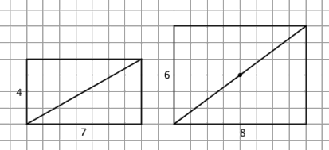
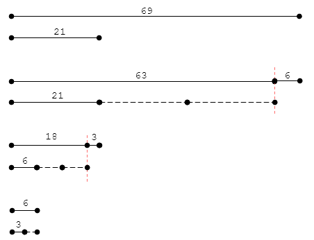

# 数论（一）

---

## 1.同余系统

### 1.1 最大公约数([Greatest common divisor](https://en.wikipedia.org/wiki/Greatest_common_divisor))

#### 1.1.1 $\gcd(x,y)$表示x和y的最大公约数，也叫最大公因数，例如$\gcd(6,15)=3$

欧几里得对“公约”的解释，给定两条长度不同的线段 a 和 b ，如果能够找到第三条线段 c ，它既可以度量 a ，又可以度量 b ，我们就说 a 和 b 是可公约的\(commensurable\)，最大可能的c就是a和b的最大公约数

#### 1.1.2 如果两个数的最大公约数是1，那么这两个数成是互质的\(relatively prime\)，比如说$\gcd(7,10)=1$

互质的几何意义，如果 a 和 b 互质，这就意味着分数 a / b 已经不能再约分了，意味着 a × b 的棋盘的对角线不会经过中间的任何交叉点，意味着循环长度分别为 a 和 b 的两个周期性事件一同上演，则新的循环长度最短为 a × b 。  



#### 1.1.3 最大公约数一般使用欧几里得碾压相除法\([Euclidean algorithm](https://en.wikipedia.org/wiki/Euclidean_algorithm)\)计算
欧几里得算法使用了如下递归式
$$
\gcd(n,m)=\gcd(m, n\bmod m)
$$
$\gcd(69,21)=3$的计算方法  
$\gcd(69,21)=\gcd(21,6)=\gcd(6,3)=3$



### 1.2 最小公倍数([Least Common Multiple](https://en.wikipedia.org/wiki/Least_common_multiple))

$lcm(x,y)$表示x和y的最小公倍数,例如$lcm(45,30)=90$
$$
\gcd(x,y)\times lcm(x,y)=xy
$$

### 1.3 模运算

#### 1.3.1 $x\bmod{n}$ 是$x$除以$n$的余数,例如$13\bmod{5}=3$

#### 1.3.2 模运算符合交换律，结合律和分配律  
$$
\begin{split} (a+b)\bmod n &=((a\bmod n)+(b\bmod n))\bmod n \\
(a-b)\bmod n &=((a\bmod n)-(b\bmod n))\bmod n \\
(a\times b)\bmod n &=((a\bmod n)\times(b\bmod n))\bmod n \\
(a\times (b+c))\bmod n &=(((a\times b)\bmod n)+((a\times c)\bmod n))\bmod n \end{split}
$$

#### 1.3.3 如何计算$a^x\bmod n$
如果$x$是2的幂次方，例如16，那么 $a^{16}\bmod n=(((a^2\bmod n)^2\bmod n)^2\bmod n)^2\bmod n$  
如果$x$不是2的幂次方，例如$a^{25}\bmod n$  
$25=16+8+1=(2+1)\times2\times2\times2+1$  
$a^{25}=a^{(2+1)\times2\times2\times2+1}=(((a^2\times a)^2)^2)^2\times a$  
$a^{25}\bmod n=(((((((a^2\bmod n)\times a)\bmod n)^2\bmod n)^2\bmod n)^2\bmod n)\times a)\bmod n$

### 1.4 同余等式
如果$a$和$b$除$n$的余数相同，那么记为$a\equiv b\pmod n$
如果$a\equiv b\pmod n$，那么$b\equiv a\pmod n$
如果$a\equiv b\pmod n, b\equiv c\pmod n$，那么记为$a\equiv b\equiv a\pmod n$
如果$a_1\equiv b_1\pmod{m}, a_2\equiv b_2\pmod{m}, \ldots, a_n\equiv b_n\pmod{m}$，那么
$$
\begin{split} a_1+a_2+\ldots+a_n &\equiv (b_1+b_2+\ldots+b_n)\pmod{m} \\ a_1a_2\ldots a_n &\equiv (b_1 b_2\ldots b_n)\pmod{m}\end{split}
$$

## 2.中国剩余定理

### 2.1 孙子算经中的问题

> “今有物，不知其数。三、三数之，剩二；五、五数之，剩三；七、七数之，剩二。问物几何？答曰：二十三。”  
> 《孙子算经》卷下第二十六问

### 2.2 数学解释 
有$m$个两两互质的数，其乘积为$P$，有一个未知数$M$，如果我们已知$M$分别除以这$m$个数所得的余数，那么在0到$P – 1$的范围内，我们可以唯一地确定这个$M$

### 2.3 直觉  
两个除数的情况为例，假设两个除数分别是 4 和 7。下表显示的就是各自然数除以 4 和除以 7 的余数情况

|$i$|$0$|$1$|$2$|$3$|$4$|$5$|$6$|$7$|$8$|$9$|$10$|$11$|$12$|$13$|$14$|$15$|$16$|$17$|$18$|$19$|
|:-:|:-:|:-:|:-:|:-:|:-:|:-:|:-:|:-:|:-:|:-:|:-:|:-:|:-:|:-:|:-:|:-:|:-:|:-:|:-:|:-:|
|$i\bmod 4$|0|1|2|3|0|1|2|3|0|1|2|3|0|1|2|3|0|1|2|3|
|$i\bmod 7$|0|1|2|3|4|5|6|0|1|2|3|4|5|6|0|1|2|3|4|5|
|$i$|$20$|$21$|$22$|$23$|$24$|$25$|$26$|$27$|$28$|$29$|$30$|$31$|$32$|$33$|$34$|$35$|$36$|$37$|$38$|$39$|
|$i\bmod 4$|0|1|2|3|0|1|2|3|0|1|2|3|0|1|2|3|0|1|2|3|
|$i\bmod 7$|6|0|1|2|3|4|5|6|0|1|2|3|4|5|6|0|1|2|3|4|


可以看出，$i\bmod 4, i\bmod 7$的结果以$4×7 = 28$长度循环，每种特性的组合都在这28个结果中出现，所以一旦确定$i \bmod 4$和$i \bmod 7$的余数，就一定能唯一判定出$i$

### 2.4 数学表达
已知$m_1,m_2,\ldots,m_k$是两两互质的正整数，有未知数$x$满足同余方程组
$$
x\equiv a_1\pmod{m_1} \\
x\equiv a_2\pmod{m_2} \\
\cdots \\
x\equiv a_k\pmod{m_k} \\
$$
那么
$$
x=(a_1M_1M_1^{-1}+a_2M_2M_2^{-1}+\ldots+a_kM_kM_k^{-1})\bmod {M}
$$
其中$M=m_1\cdot m_2\cdot\ldots\cdot m_k, M_i=M/m_i$, 而$M_i^{-1}$是$M_i$的逆元（见3.3节），也就是$M_iM_i^{-1}\equiv 1\pmod{m_i}$

### 2.5 举例，孙子算经中的问题
$m_1=3,m_2=5,m_3=7,a_1=2,a_2=3,a_3=2$，那么
$$\begin{split}
M&=3\times5\times7=105\\ 
M_1&=5\times7=35\\ 
M_2&=3\times7=21\\ 
M_3&=3\times5=15\\ 
M_1^{-1}&=35^{\phi(3)-1}\bmod{2}=2 \\
M_2^{-1}&=21^{\phi(5)-1}\bmod{5}=1 \\
M_3^{-1}&=15^{\phi(7)-1}\bmod{7}=1 \\
x&=(2\times35\times2+3\times21\times1+2\times15\times1)\bmod 105=23
\end{split}
$$


## 3.欧拉定理

### 3.1 欧拉函数
任意给定正整数$n$，小于等于$n$的正整数之中，与n构成互质关系的数的个数记为$\phi(n)$  
$$\phi(1)=1$$
如果$p$是质数，那么$\phi(p)=p-1$， $\phi(p^k)=p^k-p^{k-1}$  
如果$n=pq, \phi(n)=\phi(p)\phi(q)=(p-1)(q-1)$  
如果$n=p_1^{k1}p_2^{k2}\ldots p_r^{kr}$，那么
$$
\phi(n)=n(1-\frac{1}{p_1})(1-\frac{1}{p_2})\ldots(1-\frac{1}{p_r})
$$

比如$\phi(1323)=\phi(3^3\times 7^2)=1323(1-\frac{1}{3})(1-\frac{1}{7})=756$

### 3.2 欧拉定理
如果$a$和$n$互质，那么
$$
a^{\phi(n)}\equiv1\pmod n
$$
#### 3.2.1 
$\phi(10)=4$，$7^{\phi(10)}\equiv7^4\equiv2401\equiv1\pmod {10}$
#### 3.2.2 
$7^{4k}\equiv(7^4)^k\equiv\underbrace{7^4\times 7^4\times\ldots\times7^4}_{\text k}\equiv\underbrace{1\times 1\times\ldots\times1}_{\text k}\pmod n$，所以$7^{4k}$尾数一定是1
#### 3.2.3 
由于$7^{4k}\equiv1\pmod {10}, 7^{2}\equiv9\pmod {10}$, 所以$7^{222}\equiv 7^{4\times55+2}\equiv(\underbrace{1\times 1\times\ldots\times 1}_{55}\times 9)\pmod{10}$，所以$7^{222}$尾数为9

### 3.3 模反元素（逆元）
如果$a$和$n$互质，那么$ax\equiv 1\pmod n$有解，$x$称为$a$模$n$的模反元素
#### 3.3.1 
用欧拉定理证明$a^{\phi(n)}\equiv a\times a^{\phi(n)-1}\equiv1\pmod {n}$，所以$a^{\phi(n)-1}+kn$都是a的模反元素
#### 3.3.2 
例如求解同余方程$3x\equiv1\pmod{11}$，那么$3^{\phi(11)-1}\equiv3^9\equiv19683\equiv4\pmod{11}$，所以$4+11k$都是同余方程的解

### 3.4 费马小定理
根据欧拉定理，当$p$是一个质数时，对于任意正整数$a$，有$a^p\equiv a\pmod{p}$，如果$p\nmid a$，那么
$$
a^{p-1}\equiv1\pmod{p}
$$

## 4.扩展碾压相除法

### 4.1 裴蜀定理
对于方程$ax+by=d$，当且仅当$\gcd(a,b)\mid{d}$时，方程有整数解

### 4.2 算法实现
对于方程$ax+by=\gcd(a,b)$, 假设方程$bx+(a\bmod b)y=\gcd(a,a\bmod b)$有整数解$(x',y')$，由于$\gcd(a,b)=\gcd(b,a\bmod b)$,可以得到
$$
ax+by=bx'+(a\bmod b)y'=ay'+b(x'-\lfloor\frac{a}{b}\rfloor y')
$$
所以
$$
x=y', y=x'-\lfloor\frac{a}{b}\rfloor y'
$$
用递归算法实现
```cpp :no-line-numbers
pair<int,int> exgcd(int a,int b){
    if(b == 0)return make_pair(1,0);
    pair<int,int>temp = exgcd(b,a%b);
    pair<int,int>ans = make_pair(temp.second,temp.first-(int)(a/b)*temp.second);
    return ans;
}
```


 


