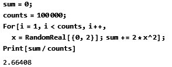
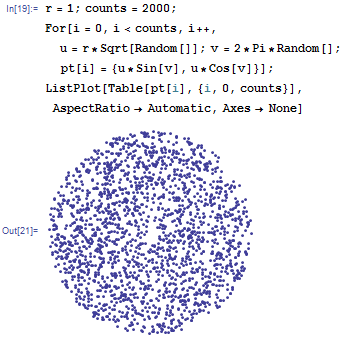

# 概率
----
## 1.随机变量
### 1.1 离散随机变量
比如扔一个质地均匀的色子，产生的结果就是一个离散随机变量，$X=\{1,2,3,4,5,6\}$，离散随机变量中的每一个可能的值$x_i$都对应一个概率$p_i$，对于扔色子这个例子，$p_i=1/6$,所有离散随机数值$x_i$的概率之和为 $\sum{p_i}=1$

### 1.2 连续随机变量
计算机中产生一个[0,1]之间的随机函数rand()，在不考虑浮点数精度时，就是一个连续的随机变量$X$

## 2. 概率分布函数(CDF)

### 2.1 定义
衡量一个随机数的概率分布规律的两个重要函数，概率分布函数(cumulative distribution function)用来定义概率累计的结果
$$
F_X(x)=P(X\leqslant x)
$$
其中函数$P$表示某事件发生的概率，也就是说$F_X(x)$表示随机变量$X$小于$x$的概率
### 2.2 举例
比如对于一个在[a,b]之间概率均匀分布的随机变量$X$
$$
F_X(x)=\begin{cases} 
0 &  {x < a} \\
\dfrac{x-a}{b-a} & {a\leqslant  x < b}\\
1 & {b\leqslant x}
\end{cases}
$$
特别的，一个在[0,1]之间均匀分布的随机变量$U$的概率分布函数
$$
F_U(x)=\begin{cases} 
0 &  {x < 0} \\
x & {0\leqslant  x < 1}\\
1 & {1\leqslant x}
\end{cases}
$$
### 2.3 特性
- $0\leq F(x)\leq 1$
- $F_X(x)$为单调上升的右连续函数
- $\displaystyle\lim_{x \to -\infty}{ F(x)=0} , \lim_{x \to +\infty}{ F(x)=1}$
- $P(a < x\leqslant b)=F(b)-F(a)$

## 3. 概率密度函数(PDF)
### 3.1 定义
对于连续性随机变量，其概率分布函数$F_X(x)$可以表达成函数$f_X(x)$的积分
$$
F_X(x)=\int_{-\infty}^{x}f_X(u)du
$$
称$f_X(x)$为随机变量$X$的概率密度函数，可以理解为随机变量$X$出现在区间$[x,x+dx]$之间的概率为$f_X(x)dx$
### 3.2 特性
- $f_X(x)=\dfrac{d}{dx}F_X(x)$
- $f_X(x)\geqslant 0, \forall x\in \mathbb{R}$
- $\displaystyle P(a < x \leqslant b)=\int_a^{b}f_X(u)du$
- $\displaystyle\int_{-\infty}^{+\infty}f_X(u)du=1$

### 3.3 举例
对于均匀分布在[a,b]之间的随机变量$U$，有
$$
f_U(x)=\begin{cases} 
1/(b-a) & {a\leqslant  x \leqslant b} \\
0 & {\text{otherwise}}
\end{cases}
$$
正态分布
$$
f(x)=\dfrac{1}{\sqrt{2\pi}}e^{-\frac{x^2}{2}}, -\infty< x < +\infty
$$

## 4. 期望值
### 4.1 定义
对于离散随机变量，定义期望值
$$
E[X]=\sum{x_i p_i}
$$
对于连续型随机变量，定义期望值
$$
E[X]=\int_{-\infty}^{+\infty}xf_X(x)dx
$$
比如对于扔色子的结果
$$
E[X]=\frac{1}{6}(1+2+3+4+5+6)=3.5
$$
对于标准正态分布
$$
E[X]=0
$$
### 4.2 特性
如果$c$是常量，那么
- $E[X+c]=E[X]+c$
- $E[cX]=cE[X]$
- $E[X+Y]=E[X]+E[Y]$

## 5. 大数定理
对于随机变量$X$，获取其序列值$X_1,X_2,...X_n$，当$n\rightarrow\infty$时，其平均值趋近于期望值$E(X)$
$$
P(\displaystyle\lim_{n\rightarrow+\infty}\dfrac{1}{n}(X_1+X_2+\cdots+X_n)=E[X])=1
$$

## 6. 蒙特卡洛积分法
### 6.1 定义
想求一个函数$g(x)$在[a,b]区间的定积分
$$
I=\displaystyle\int_{a}^{b}g(x)dx
$$
定义一个随机数序列$\{X_i\}$，$X_i$在[a,b]区间的概率密度函数为$f_X$,定义
$$
g'(x)=\dfrac{g(x)}{f_X(x)}
$$
那么序列$\{g'(X_i)\}$也是一组随机数序列，其期望值
$$
E[g'(X_i)]=\int_{a}^{b}g'(x)f_X(x)dx=\int_{a}^{b}g(x)dx=I
$$
根据大数定理
$$
E[g'(X_i)]=\lim_{n\rightarrow+\infty}\dfrac{1}{n}\sum_{i=1}^{n}g'(X_i)
$$
所以
$$
\displaystyle\int_{a}^{b}g(x)dx\approx\dfrac{1}{N}\sum_{i=1}^{N}\dfrac{g(X_i)}{f_X(X_i)}
$$
### 6.2举例
比如需要计算
$$
I=\int_{0}^{2}x^2dx=\dfrac{8}{3}
$$
设随机变量$X$在[0,2]区间均匀分布，那么$f_X=1/2$,那么
$$
I\approx\dfrac{1}{N}\sum_{i=1}^{N}2X_i^2
$$
用Mathmatica模拟

## 7. 采样函数
计算机中生成的随机数一般是概率均匀分布的随机变量，一般用$\xi$表示均匀分布在[0,1]之间的随机变量，如果一个随机变量$X$的概率密度函数为$f_X$，概率分布函数为$F_X$，那么产生随机变量$X$的采样函数为概率分布函数的反函数
$$
F_X^{-1}(\xi)
$$
### 7.1 证明
随机变量$\xi$有一个很重要的特性
$$
P(\xi\leqslant a)=a
$$
随机变量的概率的分布函数$F_X$肯定是单调递增函数，所以它的反函数也一定是单调递增函数，所以
$$\begin{split}
P(F_X^{-1}(\xi)\leqslant x)&=P(F_X(F_X^{-1}(\xi))\leqslant F_X(x))\\
&=P(\xi\leqslant F_X(x))\\
&=F_X(x)
\end{split}$$

### 7.2 举例
比如想产生一个随机点，均匀分布在一个半径为R的圆内，设产生的随机点的极坐标为$(\rho,\theta)$，那么$\rho$的概率分布函数
$$
F_\rho(r)=P(\rho\leqslant r)=r^2/R^2 \\
$$
所以产生随机点的采样函数为
$$\begin{split}
\rho&=F_\rho^{-1}(\xi_\rho)=R\sqrt{\xi_\rho} \\
\theta&=2\pi\xi_\theta
\end{split}$$

